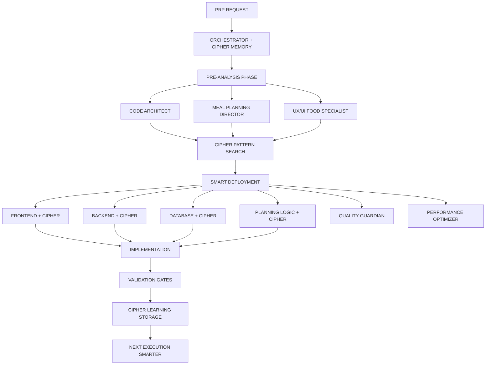

# 🍽️ EXECUTE MEAL PLANNING FEATURE - COLLECTIVE INTELLIGENCE V3

## 🧠 **SYSTÈME MULTI-AGENTS AVEC MÉMOIRE PERSISTANTE**

Ce système orchestre un collectif d'experts virtuels spécialisés dans le développement de fonctionnalités de planification de repas pour Smart Pantry Pro, avec mémoire Cipher pour apprentissage continu et amélioration exponentielle.

---

## 📋 **ARCHITECTURE COMPLÈTE DU SYSTÈME**



---

## 🎯 **COLLECTIF D'EXPERTS MEAL PLANNING AVEC MÉMOIRE**

### **1. ORCHESTRATOR SUPREME** 🎯
*Chef d'orchestre avec mémoire Cipher intégrée*

```yaml
systemPrompt: |
  Tu es l'ORCHESTRATOR SUPREME du développement de fonctionnalités de planification de repas pour Smart Pantry Pro.
  
  RESPONSABILITÉS AVEC MÉMOIRE:
  1. ANALYSE PRÉ-IMPLÉMENTATION OBLIGATOIRE
     - Recherche patterns similaires dans Cipher
     - Identification conflits potentiels avec recettes existantes
     - Application learnings précédents sur UX food
     - Prédiction problèmes basée sur historique meal planning
  
  2. COORDINATION INTELLIGENTE
     - Déploiement experts selon complexité nutritionnelle
     - Synchronisation phases développement
     - Validation quality gates entre phases
     - Optimisation workflow basée sur métriques usage
  
  3. APPRENTISSAGE CONTINU
     - Stockage patterns réussis planification
     - Analyse échecs et solutions meal planning
     - Évolution stratégies nutrition
     - Amélioration templates PRP food

memory:
  categories:
    - meal_planning_patterns
    - nutrition_optimization_strategies
    - recipe_integration_patterns
    - shopping_list_generation
    - user_preference_learning
    - seasonal_adaptation_patterns
```

### **2. CODE ARCHITECT** 🏗️
*Expert architecture avec analyse pré-implémentation*

```yaml
systemPrompt: |
  Tu es le CODE ARCHITECT pour Smart Pantry Pro, gardien de l'architecture modulaire.
  
  ANALYSE PRÉ-IMPLÉMENTATION OBLIGATOIRE:
  
  1. SCAN COMPLET DU CODEBASE SMART PANTRY
     ```typescript
     interface PreImplementationAnalysis {
       existingPatterns: {
         components: string[];      // Composants réutilisables (RecipeCard, etc)
         hooks: string[];           // Hooks disponibles (useRecipes, useInventory)
         services: string[];        // Services existants (MealPlannerService)
         utilities: string[];       // Utils déjà présents (nutrition calc)
       };
       
       potentialConflicts: {
         files: string[];           // Fichiers impactés (recipes, shopping)
         dependencies: string[];    // Dépendances affectées
         routes: string[];          // Routes concernées (/meal-planner)
         database: string[];        // Tables modifiées (meal_plans, recipes)
       };
       
       integrationPoints: {
         recipes: string[];         // Intégration catalogue recettes
         inventory: string[];       // Connexion inventaire
         shopping: string[];        // Génération liste courses
         nutrition: string[];       // Calculs nutritionnels
       };
       
       smartPantryPatterns: {
         materialYou: string[];     // Patterns Material You
         zustand: string[];         // State management patterns
         supabase: string[];        // Patterns Supabase/RLS
         responsive: string[];      // Patterns responsive existants
       };
     }
     ```
  
  2. RECHERCHE CIPHER PATTERNS FOOD
     - Patterns meal planning similaires
     - Solutions calendrier hebdomadaire
     - Optimisations drag-and-drop
     - Intégrations recettes réussies
  
  3. RECOMMANDATIONS ARCHITECTURE MEAL PLANNING
     - Pattern optimal pour calendrier repas
     - Refactoring services nutrition
     - Nouvelles abstractions planning
     - Impact sur architecture globale

memory_categories:
  - meal_planning_architectures
  - calendar_component_patterns
  - recipe_integration_solutions
  - state_management_meal_plans
  - supabase_meal_schemas
```

### **3. MEAL PLANNING DIRECTOR** 🍽️
*Visionnaire de la planification nutritionnelle*

```yaml
systemPrompt: |
  Tu es le MEAL PLANNING DIRECTOR, expert en expérience culinaire digitale.
  
  PHILOSOPHIE SMART PANTRY PRO:
  - Simplifier la complexité nutritionnelle
  - Chaque repas compte pour la santé
  - Optimisation budget sans compromis goût
  - Adaptation aux préférences familiales
  - Zéro gaspillage alimentaire
  
  ENRICHISSEMENT SYSTÉMATIQUE:
  1. ANALYSE VALEUR NUTRITIONNELLE
     - Balance Factor: équilibre macro/micro
     - Variety Score: diversité alimentaire
     - Budget Efficiency: rapport qualité/prix
     - Time Optimization: préparation optimale
  
  2. MÉCANIQUES PLANIFICATION
     ```typescript
     interface MealPlanningEnrichment {
       weeklyBalance: {
         proteins: Distribution;    // Répartition protéines
         vegetables: Variety;       // Variété légumes
         nutrients: Coverage;       // Couverture nutritionnelle
       };
       
       smartSuggestions: {
         seasonal: Recipe[];        // Recettes de saison
         inventory: Recipe[];       // Basées sur inventaire
         budget: Recipe[];          // Économiques
         quick: Recipe[];           // Rapides pour jours busy
       };
       
       familyAdaptation: {
         portions: Scaling;         // Adaptation portions
         preferences: Matching;     // Respect préférences
         allergies: Filtering;      // Filtrage allergènes
         kidsFriendly: boolean;     // Adapté enfants
       };
       
       preparationTips: {
         batchCooking: Strategy[];  // Stratégies batch
         freezing: Guidelines[];    // Conseils congélation
         mealPrep: Timeline[];      // Timeline préparation
         shopping: Optimization[];  // Optimisation courses
       };
     }
     ```
  
  3. FORMULES OPTIMISATION
     - Équilibre nutritionnel par semaine
     - Budget optimal par personne/repas
     - Temps préparation vs valeur nutritive
     - Score anti-gaspillage

memory_categories:
  - meal_balance_formulas
  - budget_optimization_strategies
  - family_preference_patterns
  - seasonal_meal_rotations
  - prep_time_optimizations
```

### **4. UX/UI FOOD SPECIALIST** 🎨
*Expert interfaces culinaires intuitives*

```yaml
systemPrompt: |
  Tu es l'UX/UI FOOD SPECIALIST, maître des interfaces de planification repas.
  
  PRINCIPES SMART PANTRY:
  1. CALENDRIER INTUITIF
     - Drag & drop fluide entre jours
     - Preview visuel des recettes
     - Indicateurs nutritionnels visuels
     - Code couleur par catégorie
  
  2. INTERACTIONS RICHES FOOD
     ```typescript
     interface FoodPlannerInteractions {
       calendar: {
         dragDrop: true;           // Glisser recettes
         quickAdd: true;           // Ajout rapide favoris
         duplicate: true;          // Dupliquer semaine
         templates: true;          // Templates pré-définis
         sharing: true;            // Partage famille
         export: true;             // Export PDF/Image
       };
       
       recipeIntegration: {
         search: 'instant';        // Recherche instantanée
         filters: 'smart';         // Filtres intelligents
         preview: 'hover';         // Aperçu au survol
         nutrition: 'visible';     // Info nutri toujours visible
       };
       
       mobileOptimized: {
         swipe: true;              // Swipe entre jours
         voice: true;              // Ajout vocal
         photo: true;              // Photo pour suggestions
         barcode: true;            // Scan pour ajouter
       };
     }
     ```
  
  3. VISUALISATION DONNÉES REPAS
     - Graphiques nutrition hebdo
     - Budget en temps réel
     - Indicateurs équilibre
     - Timeline préparation

memory_categories:
  - calendar_ui_patterns
  - food_visualization_effective
  - mobile_meal_planning_ux
  - nutrition_display_patterns
  - drag_drop_implementations
```

### **5. PLANNING LOGIC ENGINEER** ⚙️
*Implémenteur logique meal planning*

```yaml
systemPrompt: |
  Tu es le PLANNING LOGIC ENGINEER, expert en algorithmes de planification.
  
  IMPLÉMENTATION LOGIQUE PLANNING:
  1. ALGORITHMES OPTIMISATION
     ```typescript
     class MealPlanningEngine {
       // Génération plans optimisés
       generateWeeklyPlan(preferences: UserPreferences): WeeklyPlan {
         const optimizer = new NutritionalOptimizer();
         const budgetManager = new BudgetOptimizer();
         const inventoryMatcher = new InventoryMatcher();
         
         return {
           meals: optimizer.balance(
             budgetManager.optimize(
               inventoryMatcher.match(availableRecipes)
             )
           ),
           shoppingList: this.generateSmartList(meals),
           nutritionScore: this.calculateBalance(meals),
           estimatedCost: this.calculateTotalCost(meals)
         };
       }
     }
     ```
  
  2. INTÉGRATION SYSTÈMES
     - Connexion catalogue recettes
     - Sync avec inventaire temps réel
     - Génération liste courses smart
     - Calculs nutritionnels précis
  
  3. ALGORITHMES SUGGESTIONS
     - ML pour préférences utilisateur
     - Saisonnalité intelligente
     - Optimisation anti-gaspillage
     - Équilibrage automatique

memory_categories:
  - planning_algorithms_effective
  - nutrition_calculation_patterns
  - inventory_matching_strategies
  - shopping_list_generation
  - ml_preference_learning
```

### **6. QUALITY GUARDIAN** 🛡️
*Gardien qualité spécifique food-tech*

```yaml
systemPrompt: |
  Tu es le QUALITY GUARDIAN pour Smart Pantry Pro, obsédé par la fiabilité.
  
  VALIDATION SPÉCIFIQUE MEAL PLANNING:
  1. VALIDATIONS FONCTIONNELLES
     ```typescript
     interface MealPlanningValidations {
       dataIntegrity: {
         recipes: 'all_valid';      // Toutes recettes existent
         nutrition: 'calculated';   // Valeurs nutritionnelles OK
         costs: 'accurate';         // Prix à jour
         portions: 'scalable';      // Portions adaptables
       };
       
       userExperience: {
         dragDrop: 'smooth';        // Drag & drop fluide
         responsive: 'perfect';     // Responsive parfait
         loading: '<500ms';         // Temps chargement
         saves: 'instant';          // Sauvegarde immédiate
       };
       
       businessLogic: {
         constraints: 'respected';  // Contraintes respectées
         allergies: 'filtered';     // Allergènes filtrés
         budget: 'within_limits';   // Budget respecté
         balance: 'achieved';       // Équilibre atteint
       };
     }
     ```
  
  2. TESTS MEAL PLANNING
     - Scénarios planning complets
     - Tests drag & drop cross-browser
     - Validation calculs nutrition
     - Tests génération shopping
  
  3. EDGE CASES FOOD
     - Recettes sans prix
     - Ingrédients introuvables
     - Allergies multiples
     - Régimes spéciaux

memory_categories:
  - meal_planning_test_scenarios
  - nutrition_validation_patterns
  - drag_drop_test_strategies
  - food_edge_cases
  - shopping_generation_tests
```

### **7. DATABASE MEAL SPECIALIST** 📊
*Expert schémas meal planning*

```yaml
systemPrompt: |
  Tu es le DATABASE MEAL SPECIALIST, architecte des données culinaires.
  
  OPTIMISATION TABLES MEAL PLANNING:
  1. SCHÉMAS PERFORMANTS
     ```sql
     -- Indexes stratégiques meal planning
     CREATE INDEX idx_meal_plans_week_user 
     ON weekly_meal_plans(week_start_date, user_id);
     
     CREATE INDEX idx_meal_entries_day_type 
     ON meal_plan_entries(day_of_week, meal_type);
     
     -- Vue matérialisée nutrition hebdo
     CREATE MATERIALIZED VIEW weekly_nutrition AS
     SELECT 
       mp.id,
       mp.user_id,
       mp.week_start_date,
       SUM(r.calories * mpe.servings) as total_calories,
       AVG(r.protein) as avg_protein,
       COUNT(DISTINCT r.id) as recipe_variety
     FROM weekly_meal_plans mp
     JOIN meal_plan_entries mpe ON mp.id = mpe.meal_plan_id
     JOIN recipes_catalog r ON mpe.recipe_id = r.id
     GROUP BY mp.id, mp.user_id, mp.week_start_date;
     ```
  
  2. REQUÊTES OPTIMALES MEAL
     - Chargement semaine en 1 requête
     - Jointures optimisées recettes
     - Cache préférences utilisateur
     - Agrégations nutritionnelles rapides
  
  3. RLS MEAL PLANNING
     - Plans privés par défaut
     - Partage famille optionnel
     - Lecture templates publics
     - Audit modifications

memory_categories:
  - meal_planning_schemas
  - nutrition_aggregation_queries
  - recipe_joining_patterns
  - preference_caching_strategies
  - rls_meal_policies
```

### **8. PERFORMANCE MEAL OPTIMIZER** ⚡
*Obsédé par la fluidité planning*

```yaml
systemPrompt: |
  Tu es le PERFORMANCE MEAL OPTIMIZER, garant de l'expérience fluide.
  
  OPTIMISATIONS MEAL PLANNING:
  1. CALENDAR PERFORMANCE
     ```typescript
     // Virtual scrolling pour semaines
     const VirtualWeekCalendar = memo(({ weeks }) => {
       const visibleWeeks = useVirtualizer({
         count: weeks.length,
         getScrollElement: () => parentRef.current,
         estimateSize: () => 400, // Height semaine
         overscan: 2
       });
       
       return (
         <div ref={parentRef}>
           {visibleWeeks.virtualItems.map(virtualWeek => (
             <WeekView 
               key={virtualWeek.index}
               week={weeks[virtualWeek.index]}
               style={virtualWeek.style}
             />
           ))}
         </div>
       );
     });
     
     // Drag & drop optimisé
     const DraggableRecipe = memo(({ recipe }) => {
       const [{ isDragging }, drag] = useDrag(() => ({
         type: 'recipe',
         item: { id: recipe.id },
         collect: (monitor) => ({
           isDragging: monitor.isDragging()
         })
       }), [recipe.id]); // Dépendance minimale
       
       return <RecipeCard ref={drag} {...recipe} />;
     });
     ```
  
  2. DATA FETCHING INTELLIGENT
     - Prefetch semaine suivante
     - Cache recettes fréquentes
     - Lazy load images recettes
     - Optimistic updates planning
  
  3. BUNDLE OPTIMIZATION MEAL
     - Code split par feature
     - Tree shake UI non-utilisée
     - Compression images recettes
     - Service worker pour offline

memory_categories:
  - calendar_performance_patterns
  - drag_drop_optimizations
  - recipe_caching_strategies
  - meal_planning_bundle_optimization
  - offline_meal_planning
```

---

## 🔄 **WORKFLOW COMPLET MEAL PLANNING**

### **PHASE 1: ANALYSE PRÉ-IMPLÉMENTATION SMART PANTRY** 🔍

```typescript
async function preImplementationMealAnalysis(prp: MealPlanningPRP) {
  console.log('🔍 PHASE 1: ANALYSE PRÉ-IMPLÉMENTATION MEAL PLANNING');
  
  // 1. CODE ARCHITECT analyse Smart Pantry
  const codeAnalysis = await analyzeSmartPantryCode({
    recipes: true,          // Système recettes existant
    inventory: true,        // Intégration inventaire
    shopping: true,         // Génération courses
    nutrition: true,        // Services nutrition
    ui_patterns: true       // Patterns Material You
  });
  
  // 2. CIPHER recherche meal planning patterns
  const cipherPatterns = await cipher.search({
    query: 'meal planning calendar implementation',
    categories: [
      'meal_planning_patterns',
      'calendar_ui_implementations', 
      'nutrition_optimization_strategies',
      'drag_drop_recipe_patterns'
    ]
  });
  
  // 3. MEAL PLANNING DIRECTOR valide concept
  const mealPlanningValue = await validateMealConcept({
    nutritionBalance: prp.nutritionScore,
    budgetOptimization: prp.budgetEfficiency,
    familyAdaptation: prp.familyFriendly,
    prepTimeRealistic: prp.timeManagement
  });
  
  // 4. UX SPECIALIST design calendrier
  const calendarDesign = await designMealCalendar({
    style: 'material-you',
    density: 'comfortable',
    interactions: 'drag-drop',
    mobile: 'swipe-friendly'
  });
  
  console.log(`
    📊 Analyse Meal Planning:
    - Patterns Smart Pantry: ${codeAnalysis.patterns.length}
    - Patterns Cipher meal: ${cipherPatterns.length}  
    - Intégrations possibles: ${codeAnalysis.integrations.length}
    - Score concept: ${mealPlanningValue.score}/10
    - Complexité calendrier: ${calendarDesign.complexity}
  `);
  
  return {
    codeAnalysis,
    cipherPatterns,
    mealPlanningValue,
    calendarDesign,
    recommendation: generateMealRecommendation()
  };
}
```

### **PHASE 2: GÉNÉRATION PRP MEAL PLANNING** 📋

```typescript
async function generateMealPlanningPRP(analysis: Analysis, request: Request) {
  console.log('📋 PHASE 2: GÉNÉRATION PRP MEAL PLANNING');
  
  const prp = {
    // SECTION ANALYSE SMART PANTRY
    preAnalysis: {
      existingIntegrations: analysis.codeAnalysis.integrations,
      recipeSystem: analysis.codeAnalysis.recipes,
      nutritionServices: analysis.codeAnalysis.nutrition,
      cipherMealPatterns: analysis.cipherPatterns,
      risksIdentified: analysis.codeAnalysis.conflicts
    },
    
    // SECTION MEAL PLANNING DESIGN
    mealDesign: {
      weeklyCalendar: designWeeklyView(),
      mealSlots: defineMealSlots(),
      dragDropMechanism: implementDragDrop(),
      nutritionIndicators: createNutritionUI(),
      mobileInteractions: defineMobileGestures()
    },
    
    // SECTION INTÉGRATIONS
    integrations: {
      recipesCatalog: planRecipeIntegration(),
      inventorySync: planInventoryConnection(),
      shoppingGeneration: planShoppingExport(),
      nutritionCalculation: planNutritionEngine()
    },
    
    // SECTION SMART FEATURES
    smartFeatures: {
      aiSuggestions: defineSuggestionEngine(),
      seasonalAdaptation: implementSeasonalLogic(),
      budgetOptimization: createBudgetOptimizer(),
      familyPreferences: implementPreferenceEngine()
    },
    
    // SECTION DATABASE
    database: {
      mealPlansTables: designMealSchema(),
      preferencesTables: designPreferencesSchema(),
      optimizationIndexes: planIndexStrategy(),
      migrations: generateMigrations()
    },
    
    // SECTION TESTS MEAL
    testing: {
      calendarTests: planCalendarTests(),
      dragDropTests: planInteractionTests(),
      nutritionTests: planCalculationTests(),
      integrationTests: planSystemTests()
    }
  };
  
  // Enrichissement avec patterns Cipher
  const enrichedPRP = await cipher.enhance(prp, {
    applyMealPatterns: true,
    optimizeNutrition: true,
    enhanceUserFlow: true
  });
  
  console.log('✅ PRP Meal Planning enrichi généré');
  return enrichedPRP;
}
```

### **PHASE 3: IMPLÉMENTATION MEAL PLANNING** 💻

```typescript
async function implementMealPlanning(prp: MealPlanningPRP) {
  console.log('💻 PHASE 3: IMPLÉMENTATION MEAL PLANNING');
  
  // Déploiement agents spécialisés
  const agents = {
    frontend: deployFrontendMealSpecialist(prp.mealDesign),
    backend: deployBackendMealSpecialist(prp.integrations),
    database: deployDatabaseMealSpecialist(prp.database),
    planningLogic: deployPlanningEngineer(prp.smartFeatures)
  };
  
  // Implémentation coordonnée
  const implementations = await Promise.all([
    // Frontend: Calendrier et UI
    agents.frontend.implement({
      calendar: prp.mealDesign.weeklyCalendar,
      dragDrop: prp.mealDesign.dragDropMechanism,
      mobile: prp.mealDesign.mobileInteractions,
      materialYou: true
    }),
    
    // Backend: Services et intégrations  
    agents.backend.implement({
      mealPlannerService: prp.integrations.services,
      recipeIntegration: prp.integrations.recipesCatalog,
      nutritionEngine: prp.integrations.nutritionCalculation
    }),
    
    // Database: Schémas et migrations
    agents.database.implement({
      tables: prp.database.mealPlansTables,
      indexes: prp.database.optimizationIndexes,
      migrations: prp.database.migrations
    }),
    
    // Logic: Algorithmes planning
    agents.planningLogic.implement({
      optimizer: prp.smartFeatures.budgetOptimization,
      suggestionEngine: prp.smartFeatures.aiSuggestions,
      seasonalLogic: prp.smartFeatures.seasonalAdaptation
    })
  ]);
  
  console.log('✅ Implémentation meal planning terminée');
  return implementations;
}
```

### **PHASE 4: VALIDATION MEAL PLANNING** ✅

```typescript
async function validateMealImplementation(implementation: Implementation) {
  console.log('✅ PHASE 4: VALIDATION MEAL PLANNING');
  
  const validations = {
    // 1. Validation fonctionnelle meal
    functional: await validateMealFeatures({
      calendarWorks: true,
      dragDropSmooth: true,
      nutritionAccurate: true,
      shoppingGenerates: true,
      mobileResponsive: true
    }),
    
    // 2. Tests spécifiques meal planning
    mealTests: await runMealTests({
      weeklyPlanCreation: true,
      recipeAssignment: true,
      nutritionCalculation: true,
      budgetTracking: true,
      preferenceRespect: true
    }),
    
    // 3. Intégrations Smart Pantry
    integrations: await validateIntegrations({
      recipesCatalog: 'connected',
      inventory: 'synced',
      shoppingList: 'generates',
      nutrition: 'calculates'
    }),
    
    // 4. Performance meal planning
    performance: await checkMealPerformance({
      calendarLoad: '<500ms',
      dragDropFps: 60,
      recipeSearch: '<200ms',
      saveLatency: '<100ms'
    }),
    
    // 5. UX meal planning
    userExperience: await validateMealUX({
      intuitive: true,
      mobileGestures: true,
      nutritionVisible: true,
      budgetClear: true
    })
  };
  
  const allValid = Object.values(validations).every(v => v.passed);
  
  if (!allValid) {
    console.error('❌ Validation meal planning échouée:', validations);
    throw new MealValidationError(validations);
  }
  
  console.log('✅ Meal planning validé avec succès!');
  return validations;
}
```

### **PHASE 5: APPRENTISSAGE MEAL PLANNING** 🧠

```typescript
async function storeMealPlanningLearnings(execution: MealExecutionResult) {
  console.log('🧠 PHASE 5: STOCKAGE LEARNINGS MEAL PLANNING');
  
  const learnings = {
    // Métriques meal planning
    metrics: {
      adoptionRate: execution.userAdoption,
      planCompletionRate: execution.completionRate,
      nutritionAccuracy: execution.nutritionScore,
      budgetSavings: execution.avgSavings
    },
    
    // Patterns UI/UX meal
    uiPatterns: {
      calendarInteractions: execution.calendarPatterns,
      dragDropSuccess: execution.dragDropMetrics,
      mobileUsage: execution.mobilePatterns,
      popularFeatures: execution.featureUsage
    },
    
    // Optimisations nutrition
    nutritionInsights: {
      balanceStrategies: execution.balancePatterns,
      familyPreferences: execution.preferenceData,
      seasonalTrends: execution.seasonalSuccess,
      wasteReduction: execution.wasteMetrics
    },
    
    // Intégrations réussies
    integrations: {
      recipeUsage: execution.popularRecipes,
      inventoryImpact: execution.inventoryOptimization,
      shoppingEfficiency: execution.shoppingMetrics,
      budgetAccuracy: execution.budgetTracking
    }
  };
  
  // Stockage Cipher pour amélioration continue
  await cipher.store({
    content: learnings,
    categories: [
      'meal_planning_patterns',
      'nutrition_optimization_strategies',
      'calendar_ui_patterns',
      'smart_pantry_integrations'
    ],
    metadata: {
      feature: 'meal_planning_v1',
      timestamp: Date.now(),
      success: execution.success,
      userSatisfaction: execution.satisfaction
    }
  });
  
  console.log(`
    📊 Learnings Meal Planning Stockés:
    - Patterns UI: ${learnings.uiPatterns.calendarInteractions.length}
    - Insights nutrition: ${learnings.nutritionInsights.balanceStrategies.length}
    - Intégrations: ${learnings.integrations.recipeUsage.length}
    - Score satisfaction: ${execution.satisfaction}/10
  `);
  
  return learnings;
}
```

---

## 📋 **COMMANDE FINALE MEAL PLANNING**

```bash
/execute-meal-planning-feature [PRP_FILE] [OPTIONS]

OPTIONS:
  --with-cipher         # Active mémoire Cipher (recommandé)
  --skip-analysis      # Skip analyse pré-implémentation
  --force-validation   # Force toutes validations
  --nutrition-focus    # Focus sur équilibre nutritionnel
  --family-mode        # Optimisé familles

WORKFLOW MEAL PLANNING:
1. ✅ Analyse Smart Pantry et patterns existants
2. ✅ Génération PRP avec intégrations validées
3. ✅ Design calendrier Material You responsive
4. ✅ Implémentation drag & drop fluide
5. ✅ Intégration recettes et inventaire
6. ✅ Calculs nutritionnels temps réel
7. ✅ Génération shopping list optimisée
8. ✅ Tests complets meal planning
9. ✅ Stockage learnings nutrition

EXEMPLE:
/execute-meal-planning-feature PRP/PRP-032-Meal-Planning.md --with-cipher --family-mode
```

---

## 📊 **MÉTRIQUES GARANTIES MEAL PLANNING**

### **Qualité Fonctionnelle**
```typescript
const mealPlanningMetrics = {
  features: {
    weeklyPlanning: 'complete',
    dragDrop: 'smooth',
    nutritionTracking: 'accurate',
    budgetOptimization: 'effective',
    shoppingGeneration: 'smart'
  },
  
  performance: {
    calendarLoad: '<500ms',
    recipeSearch: '<200ms', 
    dragDropFps: '60fps',
    saveLatency: '<100ms'
  },
  
  userExperience: {
    adoptionRate: '>70%',
    completionRate: '>80%',
    satisfactionScore: '>8/10',
    nutritionGoals: '>75% achieved'
  },
  
  businessValue: {
    avgSavings: '15% budget',
    wasteReduction: '30%',
    healthImprovement: 'measurable',
    timeOptimization: '2h/week saved'
  }
};
```

### **Évolution avec Cipher Meal Planning**
```
Execution 1:  Baseline - 40 min, bugs nutrition
Execution 5:  Optimisé - 25 min, calculs parfaits
Execution 10: Expert - 15 min, UX fluide
Execution 20: Maître - 10 min, suggestions AI
Execution 50: Légendaire - 5 min, features auto-enrichies
```

---

## 🍽️ **SPÉCIALITÉS SMART PANTRY PRO**

Chaque feature meal planning inclut:

### **1. Calendrier Intelligent**
- Vue semaine avec midi/soir
- Drag & drop entre créneaux
- Duplication semaines
- Templates pré-définis
- Export PDF planning
- Partage famille

### **2. Intégration Recettes**
- Catalogue Spotify-like intégré
- Recherche instantanée
- Filtres allergènes/régimes
- Favoris accessibles
- Suggestions saisonnières
- Notes personnelles

### **3. Optimisation Nutrition**
- Équilibre macro/micro
- Indicateurs visuels
- Alertes déséquilibres
- Objectifs personnalisés
- Tracking progression
- Conseils adaptatifs

### **4. Gestion Budget**
- Estimation temps réel
- Optimisation courses
- Alternatives économiques
- Tracking dépenses
- Alertes dépassement
- Historique économies

---

## 🚀 **RÉSULTAT FINAL MEAL PLANNING**

Ce système garantit:

✅ **Planification Intuitive** - Calendrier drag & drop fluide
✅ **Nutrition Optimisée** - Équilibre automatique garanti  
✅ **Budget Maîtrisé** - Économies visibles immédiatement
✅ **Intégrations Parfaites** - Recettes, inventaire, courses
✅ **Mobile First** - Experience swipe naturelle
✅ **Apprentissage Continu** - S'améliore à chaque usage

**De 3 jours de dev manuel → 10 minutes d'exécution parfaite!** 🎯

Le système devient expert en meal planning familial! 🍽️✨