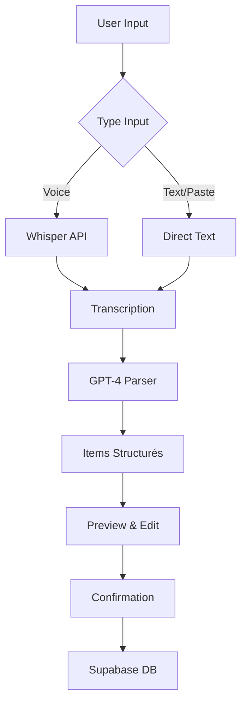

## 🚀 **SOLUTION COMPLÈTE : VOICE + TEXT INPUT INTELLIGENT**

Je vais ajouter la partie copier-coller de notes avec parsing intelligent, en complément de la solution vocale Whisper.

### **📋 ARCHITECTURE GLOBALE**



### **🎯 1. COMPOSANT SMART INPUT COMPLET (TEXT + VOICE)**

```typescript
// src/components/shopping/SmartGroceryInput.tsx

import React, { useState, useRef, useEffect } from 'react';
import { motion, AnimatePresence } from 'framer-motion';
import {
  Mic,
  MicOff,
  Loader2,
  Check,
  X,
  Edit2,
  Sparkles,
  Volume2,
  ClipboardPaste,
  Wand2,
  AlertCircle,
  Plus,
  Trash2,
  ChevronDown,
  ChevronUp
} from 'lucide-react';
import { Button } from '@/components/ui/button';
import { Card, CardContent, CardHeader, CardTitle } from '@/components/ui/card';
import { Badge } from '@/components/ui/badge';
import { Textarea } from '@/components/ui/textarea';
import { Input } from '@/components/ui/input';
import { Progress } from '@/components/ui/progress';
import { Alert, AlertDescription } from '@/components/ui/alert';
import { Tabs, TabsContent, TabsList, TabsTrigger } from '@/components/ui/tabs';
import {
  Select,
  SelectContent,
  SelectItem,
  SelectTrigger,
  SelectValue,
} from '@/components/ui/select';
import { useWhisperGroceryInput } from '@/hooks/useWhisperGroceryInput';
import { useTextGroceryParser } from '@/hooks/useTextGroceryParser';
import { cn } from '@/lib/utils';
import { STORE_SECTIONS } from '@/constants/shopping';

interface ParsedGroceryItem {
  productName: string;
  quantity: number;
  unit: string;
  category: string;
  storeSection: string;
  confidence: number;
  estimatedPrice?: number;
}

interface SmartGroceryInputProps {
  onItemsAdded?: (items: ParsedGroceryItem[]) => void;
  className?: string;
  defaultMode?: 'text' | 'voice';
}

export const SmartGroceryInput: React.FC<SmartGroceryInputProps> = ({
  onItemsAdded,
  className,
  defaultMode = 'text'
}) => {
  const [activeTab, setActiveTab] = useState(defaultMode);
  const [textInput, setTextInput] = useState('');
  const [showAdvanced, setShowAdvanced] = useState(false);
  const [editingIndex, setEditingIndex] = useState<number | null>(null);
  const [editValue, setEditValue] = useState('');
  const textareaRef = useRef<HTMLTextAreaElement>(null);

  // Hook pour l'input vocal
  const {
    isRecording,
    isProcessing: isVoiceProcessing,
    transcript,
    parsedItems: voiceParsedItems,
    recordingTime,
    startRecording,
    stopRecording,
    confirmItems: confirmVoiceItems,
    editParsedItem: editVoiceItem,
    removeParsedItem: removeVoiceItem,
    clearParsedItems: clearVoiceItems
  } = useWhisperGroceryInput();

  // Hook pour le parsing de texte
  const {
    isProcessing: isTextProcessing,
    parsedItems: textParsedItems,
    parseText,
    confirmItems: confirmTextItems,
    editParsedItem: editTextItem,
    removeParsedItem: removeTextItem,
    clearParsedItems: clearTextItems,
    error: textError
  } = useTextGroceryParser();

  // Items actuels selon le mode
  const currentItems = activeTab === 'voice' ? voiceParsedItems : textParsedItems;
  const isProcessing = isVoiceProcessing || isTextProcessing;

  // Gérer le paste depuis le clipboard
  const handlePaste = async () => {
    try {
      const text = await navigator.clipboard.readText();
      if (text) {
        setTextInput(text);
        // Auto-parse si le texte est assez long
        if (text.length > 10) {
          handleTextParse(text);
        }
      }
    } catch (error) {
      console.error('Erreur lecture clipboard:', error);
    }
  };

  // Parser le texte
  const handleTextParse = async (text?: string) => {
    const inputText = text || textInput;
    if (!inputText.trim()) return;
    
    await parseText(inputText);
  };

  // Confirmer les items
  const handleConfirm = async () => {
    let success = false;
    
    if (activeTab === 'voice') {
      success = await confirmVoiceItems();
    } else {
      success = await confirmTextItems();
    }
    
    if (success) {
      onItemsAdded?.(currentItems);
      setTextInput('');
    }
  };

  // Éditer un item
  const handleEdit = (index: number, field: string, value: string | number) => {
    if (activeTab === 'voice') {
      editVoiceItem(index, { [field]: value });
    } else {
      editTextItem(index, { [field]: value });
    }
  };

  // Supprimer un item
  const handleRemove = (index: number) => {
    if (activeTab === 'voice') {
      removeVoiceItem(index);
    } else {
      removeTextItem(index);
    }
  };

  // Clear tous les items
  const handleClearAll = () => {
    if (activeTab === 'voice') {
      clearVoiceItems();
    } else {
      clearTextItems();
      setTextInput('');
    }
  };

  // Auto-resize du textarea
  useEffect(() => {
    if (textareaRef.current) {
      textareaRef.current.style.height = 'auto';
      textareaRef.current.style.height = `${textareaRef.current.scrollHeight}px`;
    }
  }, [textInput]);

  return (
    <Card className={cn("relative overflow-hidden", className)}>
      <CardHeader className="pb-3">
        <CardTitle className="flex items-center justify-between">
          <div className="flex items-center gap-2">
            <Sparkles className="w-5 h-5 text-primary animate-pulse" />
            <span>Ajout intelligent</span>
          </div>
          <Badge variant="secondary" className="text-xs">
            IA Powered
          </Badge>
        </CardTitle>
      </CardHeader>

      <CardContent className="space-y-4">
        <Tabs value={activeTab} onValueChange={setActiveTab}>
          <TabsList className="grid w-full grid-cols-2">
            <TabsTrigger value="text" className="gap-2">
              <ClipboardPaste className="w-4 h-4" />
              Texte/Notes
            </TabsTrigger>
            <TabsTrigger value="voice" className="gap-2">
              <Mic className="w-4 h-4" />
              Voix
            </TabsTrigger>
          </TabsList>

          {/* TAB TEXTE */}
          <TabsContent value="text" className="space-y-4">
            <div className="space-y-3">
              {/* Zone de texte avec actions */}
              <div className="relative">
                <Textarea
                  ref={textareaRef}
                  placeholder="Collez votre liste ici ou tapez directement...
Ex: 2kg tomates, 1L lait, pain complet, 6 œufs"
                  value={textInput}
                  onChange={(e) => setTextInput(e.target.value)}
                  className="min-h-[100px] pr-12 resize-none"
                  onKeyDown={(e) => {
                    if (e.key === 'Enter' && e.metaKey) {
                      handleTextParse();
                    }
                  }}
                />
                
                {/* Boutons d'action superposés */}
                <div className="absolute right-2 top-2 flex flex-col gap-1">
                  <Button
                    size="icon"
                    variant="ghost"
                    onClick={handlePaste}
                    title="Coller depuis le presse-papier"
                    className="h-8 w-8"
                  >
                    <ClipboardPaste className="h-4 w-4" />
                  </Button>
                  
                  {textInput && (
                    <Button
                      size="icon"
                      variant="ghost"
                      onClick={() => setTextInput('')}
                      title="Effacer"
                      className="h-8 w-8"
                    >
                      <X className="h-4 w-4" />
                    </Button>
                  )}
                </div>
              </div>

              {/* Exemples de formats supportés */}
              <div className="flex items-start gap-2">
                <AlertCircle className="w-4 h-4 text-muted-foreground mt-0.5" />
                <div className="text-xs text-muted-foreground space-y-1">
                  <p>Formats supportés :</p>
                  <ul className="ml-4 space-y-0.5">
                    <li>• Liste simple : tomates, lait, pain</li>
                    <li>• Avec quantités : 2kg tomates, 1L lait</li>
                    <li>• Liste à puces : - tomates\n- lait</li>
                    <li>• Depuis une recette : "Pour la tarte: farine, beurre..."</li>
                  </ul>
                </div>
              </div>

              {/* Bouton d'analyse */}
              <Button
                onClick={() => handleTextParse()}
                disabled={!textInput.trim() || isTextProcessing}
                className="w-full gap-2"
              >
                {isTextProcessing ? (
                  <>
                    <Loader2 className="w-4 h-4 animate-spin" />
                    Analyse en cours...
                  </>
                ) : (
                  <>
                    <Wand2 className="w-4 h-4" />
                    Analyser avec l'IA
                  </>
                )}
              </Button>
            </div>

            {/* Erreur éventuelle */}
            {textError && (
              <Alert variant="destructive">
                <AlertCircle className="h-4 w-4" />
                <AlertDescription>{textError}</AlertDescription>
              </Alert>
            )}
          </TabsContent>

          {/* TAB VOIX */}
          <TabsContent value="voice" className="space-y-4">
            <div className="flex justify-center">
              <div className="relative">
                <Button
                  size="lg"
                  variant={isRecording ? "destructive" : "default"}
                  onClick={isRecording ? stopRecording : startRecording}
                  disabled={isVoiceProcessing}
                  className={cn(
                    "h-20 w-20 rounded-full transition-all",
                    isRecording && "animate-pulse scale-110"
                  )}
                >
                  {isVoiceProcessing ? (
                    <Loader2 className="h-8 w-8 animate-spin" />
                  ) : isRecording ? (
                    <MicOff className="h-8 w-8" />
                  ) : (
                    <Mic className="h-8 w-8" />
                  )}
                </Button>
                
                {isRecording && (
                  <div className="absolute -inset-2 rounded-full border-4 border-red-500 animate-ping" />
                )}
              </div>
            </div>

            {/* Timer et visualisation */}
            {isRecording && (
              <div className="space-y-2">
                <div className="flex justify-between text-sm text-muted-foreground">
                  <span>Enregistrement...</span>
                  <span>{recordingTime}s / 60s</span>
                </div>
                <Progress value={(recordingTime / 60) * 100} className="h-2" />
                
                <div className="flex justify-center gap-1 py-2">
                  {[...Array(5)].map((_, i) => (
                    <motion.div
                      key={i}
                      className="w-1 bg-primary rounded-full"
                      animate={{
                        height: [16, 32, 16],
                      }}
                      transition={{
                        duration: 1,
                        repeat: Infinity,
                        delay: i * 0.1,
                      }}
                    />
                  ))}
                </div>
              </div>
            )}

            {/* Transcription */}
            {transcript && !isVoiceProcessing && (
              <Card className="bg-muted/50">
                <CardContent className="pt-4">
                  <div className="flex items-start gap-2">
                    <Volume2 className="w-4 h-4 mt-1 text-muted-foreground" />
                    <p className="text-sm italic flex-1">"{transcript}"</p>
                  </div>
                </CardContent>
              </Card>
            )}

            {/* Instructions */}
            {!isRecording && !transcript && voiceParsedItems.length === 0 && (
              <div className="text-center text-sm text-muted-foreground space-y-1">
                <p>Appuyez et dictez votre liste</p>
                <p className="text-xs">
                  "2 kilos de tomates, 1 litre de lait, du pain"
                </p>
              </div>
            )}
          </TabsContent>
        </Tabs>

        {/* PREVIEW DES ITEMS PARSÉS */}
        <AnimatePresence mode="wait">
          {currentItems.length > 0 && (
            <motion.div
              initial={{ opacity: 0, y: 20 }}
              animate={{ opacity: 1, y: 0 }}
              exit={{ opacity: 0, y: -20 }}
              className="space-y-3"
            >
              {/* Header avec actions */}
              <div className="flex items-center justify-between">
                <div className="flex items-center gap-2">
                  <h4 className="font-medium">
                    Produits détectés ({currentItems.length})
                  </h4>
                  <Button
                    size="icon"
                    variant="ghost"
                    className="h-6 w-6"
                    onClick={() => setShowAdvanced(!showAdvanced)}
                  >
                    {showAdvanced ? (
                      <ChevronUp className="h-4 w-4" />
                    ) : (
                      <ChevronDown className="h-4 w-4" />
                    )}
                  </Button>
                </div>
                
                <div className="flex gap-2">
                  <Button
                    size="sm"
                    variant="outline"
                    onClick={handleClearAll}
                  >
                    <Trash2 className="w-3 h-3 mr-1" />
                    Effacer
                  </Button>
                  <Button
                    size="sm"
                    onClick={handleConfirm}
                    className="gap-1"
                  >
                    <Check className="w-4 h-4" />
                    Ajouter ({currentItems.length})
                  </Button>
                </div>
              </div>

              {/* Liste des items */}
              <div className="space-y-2 max-h-80 overflow-y-auto">
                {currentItems.map((item, index) => (
                  <motion.div
                    key={`${activeTab}-${index}`}
                    initial={{ opacity: 0, x: -20 }}
                    animate={{ opacity: 1, x: 0 }}
                    transition={{ delay: index * 0.03 }}
                    className={cn(
                      "p-3 bg-background rounded-lg border transition-colors",
                      item.confidence < 0.7 && "border-orange-200 bg-orange-50/50"
                    )}
                  >
                    {/* Ligne principale */}
                    <div className="flex items-center gap-2">
                      <div className="flex-1 flex items-center gap-2 flex-wrap">
                        {editingIndex === index ? (
                          <Input
                            value={editValue}
                            onChange={(e) => setEditValue(e.target.value)}
                            onBlur={() => {
                              handleEdit(index, 'productName', editValue);
                              setEditingIndex(null);
                            }}
                            onKeyDown={(e) => {
                              if (e.key === 'Enter') {
                                handleEdit(index, 'productName', editValue);
                                setEditingIndex(null);
                              }
                              if (e.key === 'Escape') {
                                setEditingIndex(null);
                              }
                            }}
                            className="h-7 flex-1 max-w-[200px]"
                            autoFocus
                          />
                        ) : (
                          <>
                            <span className="font-medium">
                              {item.quantity > 1 && `${item.quantity} `}
                              {item.unit !== 'pièce' && `${item.unit} `}
                              {item.productName}
                            </span>
                            <Badge 
                              variant="secondary" 
                              className="text-xs"
                            >
                              {item.storeSection}
                            </Badge>
                            {item.confidence < 0.7 && (
                              <Badge 
                                variant="outline" 
                                className="text-xs border-orange-300"
                              >
                                ⚠️ Vérifier
                              </Badge>
                            )}
                            {item.estimatedPrice && (
                              <span className="text-xs text-muted-foreground">
                                ~{item.estimatedPrice.toFixed(2)}€
                              </span>
                            )}
                          </>
                        )}
                      </div>
                      
                      <div className="flex gap-1">
                        <Button
                          size="icon"
                          variant="ghost"
                          className="h-7 w-7"
                          onClick={() => {
                            setEditingIndex(index);
                            setEditValue(item.productName);
                          }}
                        >
                          <Edit2 className="h-3 w-3" />
                        </Button>
                        <Button
                          size="icon"
                          variant="ghost"
                          className="h-7 w-7"
                          onClick={() => handleRemove(index)}
                        >
                          <X className="h-3 w-3" />
                        </Button>
                      </div>
                    </div>

                    {/* Options avancées */}
                    {showAdvanced && (
                      <div className="mt-2 pt-2 border-t grid grid-cols-3 gap-2">
                        <div className="space-y-1">
                          <label className="text-xs text-muted-foreground">
                            Quantité
                          </label>
                          <Input
                            type="number"
                            value={item.quantity}
                            onChange={(e) => 
                              handleEdit(index, 'quantity', parseInt(e.target.value) || 1)
                            }
                            className="h-7 text-xs"
                            min="1"
                          />
                        </div>
                        
                        <div className="space-y-1">
                          <label className="text-xs text-muted-foreground">
                            Unité
                          </label>
                          <Select
                            value={item.unit}
                            onValueChange={(value) => handleEdit(index, 'unit', value)}
                          >
                            <SelectTrigger className="h-7 text-xs">
                              <SelectValue />
                            </SelectTrigger>
                            <SelectContent>
                              <SelectItem value="pièce">pièce</SelectItem>
                              <SelectItem value="kg">kg</SelectItem>
                              <SelectItem value="g">g</SelectItem>
                              <SelectItem value="L">L</SelectItem>
                              <SelectItem value="ml">ml</SelectItem>
                              <SelectItem value="paquet">paquet</SelectItem>
                              <SelectItem value="boîte">boîte</SelectItem>
                            </SelectContent>
                          </Select>
                        </div>
                        
                        <div className="space-y-1">
                          <label className="text-xs text-muted-foreground">
                            Rayon
                          </label>
                          <Select
                            value={item.storeSection}
                            onValueChange={(value) => handleEdit(index, 'storeSection', value)}
                          >
                            <SelectTrigger className="h-7 text-xs">
                              <SelectValue />
                            </SelectTrigger>
                            <SelectContent>
                              {STORE_SECTIONS.map(section => (
                                <SelectItem key={section} value={section}>
                                  {section}
                                </SelectItem>
                              ))}
                            </SelectContent>
                          </Select>
                        </div>
                      </div>
                    )}
                  </motion.div>
                ))}
              </div>

              {/* Total estimé */}
              {currentItems.some(item => item.estimatedPrice) && (
                <div className="pt-2 border-t flex justify-between items-center">
                  <span className="text-sm text-muted-foreground">
                    Total estimé
                  </span>
                  <span className="font-semibold">
                    ~{currentItems.reduce((sum, item) => 
                      sum + (item.estimatedPrice || 0), 0
                    ).toFixed(2)}€
                  </span>
                </div>
              )}
            </motion.div>
          )}
        </AnimatePresence>
      </CardContent>
    </Card>
  );
};
```

### **🔧 2. HOOK POUR LE PARSING DE TEXTE**

```typescript
// src/hooks/useTextGroceryParser.ts

import { useState, useCallback } from 'react';
import { toast } from '@/components/ui/use-toast';

interface ParsedGroceryItem {
  productName: string;
  quantity: number;
  unit: string;
  category: string;
  storeSection: string;
  confidence: number;
  estimatedPrice?: number;
}

export const useTextGroceryParser = () => {
  const [isProcessing, setIsProcessing] = useState(false);
  const [parsedItems, setParsedItems] = useState<ParsedGroceryItem[]>([]);
  const [error, setError] = useState<string | null>(null);

  const parseText = useCallback(async (text: string) => {
    if (!text.trim()) return;
    
    setIsProcessing(true);
    setError(null);
    setParsedItems([]);
    
    try {
      const response = await fetch('/api/shopping/parse-text', {
        method: 'POST',
        headers: { 'Content-Type': 'application/json' },
        body: JSON.stringify({ text })
      });
      
      if (!response.ok) {
        throw new Error(`Erreur ${response.status}`);
      }
      
      const data = await response.json();
      
      if (data.items && data.items.length > 0) {
        setParsedItems(data.items);
        toast({
          title: "✅ Analyse terminée",
          description: `${data.items.length} produits détectés`
        });
      } else {
        setError("Aucun produit détecté. Essayez un format différent.");
      }
      
    } catch (err) {
      console.error('Erreur parsing:', err);
      setError("Erreur lors de l'analyse. Réessayez.");
      toast({
        title: "Erreur",
        description: "Impossible d'analyser le texte",
        variant: "destructive"
      });
    } finally {
      setIsProcessing(false);
    }
  }, []);

  const confirmItems = useCallback(async () => {
    if (parsedItems.length === 0) return false;
    
    try {
      const response = await fetch('/api/shopping/items/batch', {
        method: 'POST',
        headers: { 'Content-Type': 'application/json' },
        body: JSON.stringify({ items: parsedItems })
      });
      
      if (!response.ok) throw new Error('Erreur ajout');
      
      toast({
        title: "✅ Produits ajoutés",
        description: `${parsedItems.length} produits ajoutés à votre liste`
      });
      
      setParsedItems([]);
      return true;
      
    } catch (err) {
      console.error('Erreur confirmation:', err);
      toast({
        title: "Erreur",
        description: "Impossible d'ajouter les produits",
        variant: "destructive"
      });
      return false;
    }
  }, [parsedItems]);

  const editParsedItem = useCallback((index: number, updates: Partial<ParsedGroceryItem>) => {
    setParsedItems(prev => prev.map((item, i) => 
      i === index ? { ...item, ...updates } : item
    ));
  }, []);

  const removeParsedItem = useCallback((index: number) => {
    setParsedItems(prev => prev.filter((_, i) => i !== index));
  }, []);

  const clearParsedItems = useCallback(() => {
    setParsedItems([]);
    setError(null);
  }, []);

  return {
    isProcessing,
    parsedItems,
    error,
    parseText,
    confirmItems,
    editParsedItem,
    removeParsedItem,
    clearParsedItems
  };
};
```

### **🔌 3. API ROUTE POUR LE PARSING DE TEXTE**

```typescript
// src/app/api/shopping/parse-text/route.ts

import { NextRequest, NextResponse } from 'next/server';
import OpenAI from 'openai';
import { z } from 'zod';

const openai = new OpenAI({
  apiKey: process.env.OPENAI_API_KEY!,
});

const STORE_SECTIONS = [
  'Fruits et Légumes',
  'Boucherie',
  'Poissonnerie', 
  'Crémerie',
  'Boulangerie',
  'Épicerie salée',
  'Épicerie sucrée',
  'Boissons',
  'Surgelés',
  'Hygiène',
  'Entretien',
  'Autres'
];

export async function POST(request: NextRequest) {
  try {
    const { text } = await request.json();
    
    if (!text || typeof text !== 'string') {
      return NextResponse.json(
        { error: 'Texte manquant ou invalide' },
        { status: 400 }
      );
    }
    
    // Prompt système optimisé
    const systemPrompt = `Tu es un assistant expert en courses.
    
Analyse le texte pour extraire TOUS les produits mentionnés.
Le texte peut être :
- Une liste simple (tomates, lait, pain)
- Une liste avec quantités (2kg tomates, 1L lait)
- Une recette (pour la tarte: farine, beurre, pommes)
- Une note désorganisée
- Un message WhatsApp/SMS
- Une liste à puces

Pour chaque produit :
- productName: nom du produit (sans la quantité)
- quantity: quantité numérique (défaut: 1)
- unit: unité (pièce, kg, g, L, ml, paquet, boîte, etc.)
- category: catégorie générale
- storeSection: rayon parmi [${STORE_SECTIONS.join(', ')}]
- confidence: niveau de confiance 0-1

Règles importantes :
- Extrais TOUS les produits même s'ils sont mal orthographiés
- Devine intelligemment les quantités manquantes
- Normalise les unités (litre→L, kilogramme→kg)
- "un" ou "une" = quantity: 1
- "du" ou "de la" = quantity: 1, unit: selon produit
- Sépare les produits composés (ex: "pain et beurre" → 2 items)

Retourne UNIQUEMENT un JSON valide.`;

    const userPrompt = `Extrais TOUS les produits de ce texte :
"${text}"

Format JSON requis :
{
  "items": [
    {
      "productName": "string",
      "quantity": number,
      "unit": "string",
      "category": "string",
      "storeSection": "string",
      "confidence": number
    }
  ]
}`;

    const completion = await openai.chat.completions.create({
      model: 'gpt-4-turbo-preview',
      messages: [
        { role: 'system', content: systemPrompt },
        { role: 'user', content: userPrompt }
      ],
      response_format: { type: 'json_object' },
      temperature: 0.3,
      max_tokens: 2000
    });
    
    const parsed = JSON.parse(
      completion.choices[0].message.content || '{"items":[]}'
    );
    
    // Enrichissement avec prix estimés
    const enrichedItems = parsed.items.map((item: any) => ({
      ...item,
      estimatedPrice: estimatePrice(item),
      addedVia: 'text',
      timestamp: new Date().toISOString()
    }));
    
    return NextResponse.json({
      success: true,
      items: enrichedItems,
      originalText: text,
      stats: {
        textLength: text.length,
        itemsCount: enrichedItems.length
      }
    });
    
  } catch (error) {
    console.error('Erreur parsing texte:', error);
    return NextResponse.json(
      { error: 'Erreur lors de l\'analyse du texte' },
      { status: 500 }
    );
  }
}

function estimatePrice(item: any): number {
  const priceMap: Record<string, number> = {
    'Fruits et Légumes': 2.5,
    'Boucherie': 8.5,
    'Poissonnerie': 12,
    'Crémerie': 3.5,
    'Boulangerie': 2,
    'Épicerie salée': 3,
    'Épicerie sucrée': 3.5,
    'Boissons': 2.5,
    'Surgelés': 4,
    'Hygiène': 4.5,
    'Entretien': 5,
    'Autres': 3
  };
  
  return (priceMap[item.storeSection] || 3) * item.quantity;
}
```

### **📱 4. INTÉGRATION FINALE DANS LA PAGE**

```typescript
// src/pages/ShoppingList.tsx

import { SmartGroceryInput } from '@/components/shopping/SmartGroceryInput';
import { EnhancedShoppingList } from '@/components/shopping/EnhancedShoppingList';
import { InStoreModeCard } from '@/components/shopping/InStoreModeCard';
import { useState } from 'react';
import { useShoppingList } from '@/hooks/useShoppingList';

export default function ShoppingListPage() {
  const [refreshTrigger, setRefreshTrigger] = useState(0);
  const { refetch } = useShoppingList();
  
  const handleItemsAdded = async (items: any[]) => {
    console.log(`✅ ${items.length} items ajoutés`);
    
    // Rafraîchir la liste
    await refetch();
    setRefreshTrigger(prev => prev + 1);
    
    // Analytics
    window.gtag?.('event', 'smart_input_items_added', {
      count: items.length,
      method: items[0]?.addedVia || 'unknown'
    });
  };
  
  return (
    <div className="container mx-auto p-4 max-w-4xl space-y-6">
      {/* Smart Input en sticky */}
      <div className="sticky top-0 z-20 bg-background/95 backdrop-blur pb-4">
        <SmartGroceryInput 
          onItemsAdded={handleItemsAdded}
          defaultMode="text"
        />
      </div>
      
      {/* Mode magasin */}
      <InStoreModeCard />
      
      {/* Liste de courses */}
      <EnhancedShoppingList key={refreshTrigger} />
    </div>
  );
}
```

### **✨ 5. FEATURES BONUS**

```typescript
// src/components/shopping/QuickTemplates.tsx

export const QuickTemplates = ({ onSelect }: { onSelect: (text: string) => void }) => {
  const templates = [
    {
      name: "🥗 Salade",
      items: "salade verte, tomates cerises, concombre, feta, olives, vinaigrette"
    },
    {
      name: "🍝 Pâtes Bolo",
      items: "500g pâtes, 400g bœuf haché, sauce tomate, oignon, ail, parmesan"
    },
    {
      name: "🧹 Ménage",
      items: "liquide vaisselle, éponges, sacs poubelle, papier toilette, lessive"
    }
  ];
  
  return (
    <div className="flex gap-2 flex-wrap">
      {templates.map(template => (
        <Button
          key={template.name}
          size="sm"
          variant="outline"
          onClick={() => onSelect(template.items)}
        >
          {template.name}
        </Button>
      ))}
    </div>
  );
};
```

### **📊 6. MÉTRIQUES & MONITORING**

```typescript
// src/lib/analytics/smart-input.ts

export const trackSmartInput = {
  textPasted: (length: number) => {
    analytics.track('smart_input_text_pasted', { 
      character_count: length 
    });
  },
  
  voiceRecorded: (duration: number) => {
    analytics.track('smart_input_voice_recorded', { 
      duration_seconds: duration 
    });
  },
  
  itemsParsed: (data: {
    method: 'text' | 'voice';
    itemCount: number;
    successRate: number;
  }) => {
    analytics.track('smart_input_items_parsed', data);
  }
};
```

Cette solution complète te donne :
- ✅ **Input texte** avec copier-coller intelligent
- ✅ **Input vocal** avec Whisper
- ✅ **Parsing GPT-4** pour les deux modes
- ✅ **Preview éditable** des items détectés
- ✅ **Catégorisation automatique** par rayons
- ✅ **UX optimale** mobile et desktop

Veux-tu que j'ajoute d'autres features comme l'import depuis photo ou la sauvegarde de templates personnalisés ?