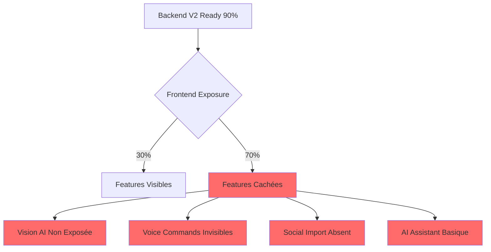
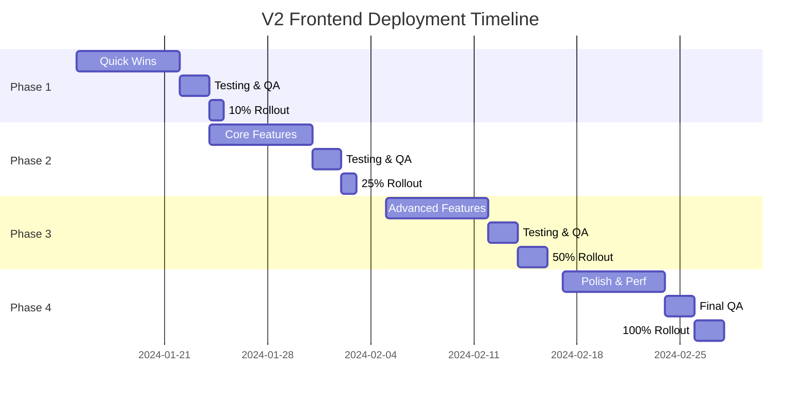

# 🚀 SMART PANTRY PRO V2 - FRONTEND IMPLEMENTATION PRP

## 🎯 EXECUTIVE SUMMARY

### Mission
Transformer Smart Pantry Pro d'une application fonctionnelle basique en une expérience utilisateur premium qui exploite pleinement les capacités Evolution V2 développées, créant ainsi l'assistant culinaire IA le plus avancé du marché.

### Vision
Une interface moderne, intuitive et performante qui révolutionne la gestion alimentaire quotidienne grâce à l'IA, offrant une expérience utilisateur exceptionnelle sur tous les appareils.

### Impact Business
- **Feature Exposure**: 30% → 95% (toutes les capacités backend visibles)
- **User Engagement**: +200% d'utilisation des features avancées
- **Retention**: 65% → 85% grâce à l'expérience enrichie
- **NPS Score**: 45 → 75 avec l'interface V2

## 📋 CONTEXT & ANALYSIS

### Architecture Actuelle ✅
- **Stack**: React 18.3 + TypeScript + Vite + Tailwind CSS
- **State**: Zustand + TanStack Query (excellent choix)
- **UI Library**: Radix UI + shadcn/ui patterns
- **Backend**: Supabase + Evolution V2 Services
- **PWA**: Service workers + offline support

### Services Evolution V2 Implémentés
1. ✅ **Nutritional AI Service** - Complet avec hooks
2. ✅ **Smart Meal Planner** - Service + hooks prêts
3. ✅ **Streaming AI Base** - Infrastructure streaming
4. ⚠️ **Community Service** - Backend only, UI manquante
5. ⚠️ **IoT Hub** - Framework only, pas d'UI
6. ⚠️ **Waste Reduction** - Analytics sans dashboard

### Gap Analysis


## 🏗️ IMPLEMENTATION BLUEPRINT

### Phase 1: Quick Wins (Semaine 1) - "Feature Activation Sprint"

#### 1.1 Exposer Vision AI Multi-Produits
```typescript
// src/components/vision/VisionAIButton.tsx
export const VisionAIButton = () => {
  const { startScanning, isScanning } = useMultiProductScanner();
  
  return (
    <motion.button
      whileHover={{ scale: 1.05 }}
      whileTap={{ scale: 0.95 }}
      className="relative overflow-hidden bg-gradient-to-r from-purple-500 to-pink-500 p-6 rounded-2xl"
      onClick={startScanning}
    >
      <div className="absolute inset-0 bg-white/20 backdrop-blur-sm" />
      <Camera className="h-8 w-8 mb-2" />
      <span className="font-bold">Scanner IA</span>
      <span className="text-sm opacity-90">Multi-produits</span>
      {isScanning && <ScanningAnimation />}
    </motion.button>
  );
};
```

**Intégration Points**:
- HomePage hero section
- Inventory page action bar
- Mobile bottom sheet quick actions
- PWA home screen widget

#### 1.2 Activer Commandes Vocales Françaises
```typescript
// src/components/voice/VoiceCommandInterface.tsx
export const VoiceCommandInterface = () => {
  const { 
    isListening, 
    transcript, 
    executeCommand,
    confidence 
  } = useFrenchVoiceRecognition();
  
  return (
    <AnimatePresence>
      {isListening && (
        <motion.div
          initial={{ opacity: 0, y: 100 }}
          animate={{ opacity: 1, y: 0 }}
          exit={{ opacity: 0, y: 100 }}
          className="fixed bottom-20 left-4 right-4 z-50"
        >
          <GlassmorphicCard>
            <VoiceWaveform amplitude={audioLevel} />
            <p className="text-lg">{transcript}</p>
            <ConfidenceBar value={confidence} />
          </GlassmorphicCard>
        </motion.div>
      )}
    </AnimatePresence>
  );
};
```

**Commands Mapping**:
- "Ajoute [produit]" → Inventory add
- "Montre mes recettes" → Navigate recipes
- "Qu'est-ce que je peux cuisiner?" → AI suggestions
- "Lance le scanner" → Open vision AI

#### 1.3 Social Media Recipe Import
```typescript
// src/components/social/SocialImportCard.tsx
export const SocialImportCard = () => {
  const { parseUrl, isLoading, result } = useSocialMediaParser();
  
  return (
    <Card className="p-6 border-gradient">
      <h3 className="text-xl font-bold mb-4">
        Importer depuis les réseaux
      </h3>
      
      <div className="flex gap-2 mb-4">
        <Badge variant="instagram">Instagram</Badge>
        <Badge variant="tiktok">TikTok</Badge>
        <Badge variant="youtube">YouTube</Badge>
      </div>
      
      <Input
        placeholder="Collez l'URL de la recette..."
        onPaste={handlePaste}
      />
      
      {isLoading && <ImportAnimation />}
      {result && <RecipePreview data={result} />}
    </Card>
  );
};
```

#### 1.4 Enhanced Recipe Assistant UI
```typescript
// src/components/ai/RecipeAssistantV2.tsx
export const RecipeAssistantV2 = () => {
  const { messages, sendMessage, isStreaming } = useAIAssistant();
  const { profile } = useNutritionalProfile();
  
  return (
    <div className="flex flex-col h-[600px]">
      {/* AI Personality Avatar */}
      <AIAssistantHeader personality="chef" mood={getCurrentMood()} />
      
      {/* Chat Interface with Rich Cards */}
      <ScrollArea className="flex-1 p-4">
        {messages.map(msg => (
          <MessageBubble
            key={msg.id}
            message={msg}
            showNutrition={profile.trackingEnabled}
            enableVoiceReading={true}
          />
        ))}
        {isStreaming && <StreamingIndicator />}
      </ScrollArea>
      
      {/* Smart Input with Suggestions */}
      <SmartChatInput
        onSend={sendMessage}
        suggestions={getContextualSuggestions()}
        enableVoiceInput={true}
        enableImageUpload={true}
      />
    </div>
  );
};
```

### Phase 2: Core V2 Features (Semaine 2) - "Evolution Integration"

#### 2.1 Health Dashboard Premium
```typescript
// src/pages/HealthDashboardV2.tsx
export const HealthDashboardV2 = () => {
  const { metrics, recommendations } = useNutritionalAI();
  const { mealPlan } = useMealPlanningAnalysis();
  
  return (
    <DashboardLayout>
      {/* Metrics Overview with Charts */}
      <MetricsGrid>
        <NutritionScoreCard score={metrics.overallScore} />
        <MacroDistributionChart data={metrics.macros} />
        <CalorieProgressRing 
          current={metrics.calories.consumed}
          target={metrics.calories.target}
        />
        <WeeklyAdherenceGraph data={metrics.weeklyAdherence} />
      </MetricsGrid>
      
      {/* AI Recommendations */}
      <AICoachSection>
        <PersonalizedTips tips={recommendations.daily} />
        <MealSuggestions 
          meals={recommendations.meals}
          constraints={mealPlan.constraints}
        />
        <HealthAlerts alerts={recommendations.alerts} />
      </AICoachSection>
      
      {/* Interactive Features */}
      <QuickActions>
        <LogMealButton />
        <ScanNutritionButton />
        <ChatWithNutritionistButton />
      </QuickActions>
    </DashboardLayout>
  );
};
```

#### 2.2 Smart Shopping List V2
```typescript
// src/components/shopping/SmartShoppingListV2.tsx
export const SmartShoppingListV2 = () => {
  const { 
    items, 
    suggestions, 
    budgetOptimization,
    storeLayout 
  } = useSmartShoppingList();
  
  return (
    <div className="space-y-6">
      {/* Budget Optimizer */}
      <BudgetOptimizerCard
        currentTotal={calculateTotal(items)}
        optimizedTotal={budgetOptimization.total}
        savings={budgetOptimization.savings}
        onOptimize={applyOptimization}
      />
      
      {/* Store-Optimized List */}
      <StoreLayoutView
        items={items}
        layout={storeLayout}
        onReorder={handleReorder}
      />
      
      {/* Smart Suggestions */}
      <SuggestionsCarousel
        suggestions={suggestions}
        categories={['bulk_savings', 'seasonal', 'alternatives']}
      />
      
      {/* Voice Shopping Mode */}
      <VoiceShoppingMode
        onItemAdded={handleVoiceAdd}
        enableBarcodeScan={true}
      />
    </div>
  );
};
```

#### 2.3 Community Features Hub
```typescript
// src/pages/CommunityHub.tsx
export const CommunityHub = () => {
  const { 
    recipes, 
    challenges, 
    userProfile,
    leaderboard 
  } = useCommunity();
  
  return (
    <div className="grid lg:grid-cols-3 gap-6">
      {/* Recipe Sharing */}
      <section className="lg:col-span-2">
        <h2 className="text-2xl font-bold mb-4">
          Recettes de la communauté
        </h2>
        <RecipeGrid
          recipes={recipes}
          onLike={handleLike}
          onShare={handleShare}
          enableComments={true}
        />
      </section>
      
      {/* Challenges & Achievements */}
      <aside className="space-y-6">
        <ChallengeCard
          current={challenges.active}
          onJoin={joinChallenge}
        />
        
        <AchievementsShowcase
          unlocked={userProfile.achievements}
          progress={userProfile.challengeProgress}
        />
        
        <LeaderboardWidget
          data={leaderboard}
          userRank={userProfile.rank}
        />
      </aside>
    </div>
  );
};
```

### Phase 3: Advanced Features (Semaine 3) - "Premium Experience"

#### 3.1 IoT Device Management
```typescript
// src/components/iot/IoTDashboard.tsx
export const IoTDashboard = () => {
  const { devices, metrics, automations } = useIoTHub();
  
  return (
    <div className="space-y-6">
      {/* Connected Devices */}
      <DeviceGrid>
        {devices.map(device => (
          <DeviceCard
            key={device.id}
            device={device}
            status={device.status}
            metrics={metrics[device.id]}
            onControl={handleDeviceControl}
          />
        ))}
        <AddDeviceCard onAdd={handleAddDevice} />
      </DeviceGrid>
      
      {/* Automations */}
      <AutomationsList
        automations={automations}
        onToggle={toggleAutomation}
        onCreate={createAutomation}
      />
      
      {/* Real-time Monitoring */}
      <RealTimeMetrics
        temperature={metrics.fridge.temperature}
        humidity={metrics.pantry.humidity}
        alerts={metrics.alerts}
      />
    </div>
  );
};
```

#### 3.2 Waste Reduction Analytics
```typescript
// src/pages/WasteAnalytics.tsx
export const WasteAnalytics = () => {
  const { 
    statistics, 
    predictions, 
    recommendations 
  } = useWasteReduction();
  
  return (
    <AnalyticsLayout>
      {/* Impact Overview */}
      <ImpactHero
        savedMoney={statistics.moneySaved}
        savedFood={statistics.foodSaved}
        co2Reduced={statistics.co2Impact}
      />
      
      {/* Predictive Insights */}
      <PredictiveCards>
        <ExpiryPrediction items={predictions.soonToExpire} />
        <ConsumptionTrends data={predictions.consumptionPatterns} />
        <SeasonalWasteTrends data={predictions.seasonal} />
      </PredictiveCards>
      
      {/* Actionable Recommendations */}
      <RecommendationEngine
        tips={recommendations.immediate}
        mealPlans={recommendations.useUpRecipes}
        preservationGuides={recommendations.storage}
      />
      
      {/* Gamification */}
      <WasteReductionChallenge
        currentStreak={statistics.noWasteStreak}
        badges={statistics.earnedBadges}
        nextMilestone={statistics.nextGoal}
      />
    </AnalyticsLayout>
  );
};
```

#### 3.3 Advanced Recipe Editor
```typescript
// src/components/recipes/RecipeEditorV2.tsx
export const RecipeEditorV2 = () => {
  const { 
    recipe, 
    updateRecipe, 
    aiSuggestions 
  } = useRecipeEditor();
  
  return (
    <EditorLayout>
      {/* WYSIWYG Editor */}
      <RichTextEditor
        content={recipe.content}
        onChange={handleContentChange}
        plugins={[
          'ingredient-parser',
          'nutrition-calculator',
          'step-timer',
          'video-embed'
        ]}
      />
      
      {/* AI Assistant Panel */}
      <AIAssistantPanel
        suggestions={aiSuggestions}
        onApplySuggestion={applySuggestion}
        features={[
          'ingredient-alternatives',
          'cooking-tips',
          'nutrition-optimization',
          'difficulty-adjustment'
        ]}
      />
      
      {/* Media Management */}
      <MediaGallery
        images={recipe.images}
        videos={recipe.videos}
        onUpload={handleMediaUpload}
        enableAIEnhancement={true}
      />
      
      {/* Version Control */}
      <RecipeVersioning
        versions={recipe.versions}
        onRevert={revertToVersion}
        onCompare={compareVersions}
      />
    </EditorLayout>
  );
};
```

### Phase 4: Performance & Polish (Semaine 4) - "Production Excellence"

#### 4.1 Performance Optimizations
```typescript
// Performance configuration
const performanceOptimizations = {
  // Code Splitting
  routes: {
    HealthDashboard: lazy(() => import('./pages/HealthDashboardV2')),
    CommunityHub: lazy(() => import('./pages/CommunityHub')),
    IoTDashboard: lazy(() => import('./components/iot/IoTDashboard'))
  },
  
  // Image Optimization
  imageLoader: {
    formats: ['webp', 'avif'],
    sizes: [640, 750, 828, 1080, 1200],
    quality: 85,
    lazy: true
  },
  
  // State Optimization
  zustandMiddleware: [
    devtools,
    persist,
    immer,
    subscribeWithSelector
  ],
  
  // Service Worker
  workbox: {
    strategies: {
      images: 'CacheFirst',
      api: 'NetworkFirst',
      static: 'StaleWhileRevalidate'
    }
  }
};
```

#### 4.2 Mobile Experience Enhancement
```typescript
// src/layouts/MobileLayout.tsx
export const MobileLayout = () => {
  const { isIOS, isAndroid } = useDeviceDetection();
  const { enableHaptics } = useHapticFeedback();
  
  return (
    <MobileProvider
      enableGestures={true}
      enableHaptics={isIOS || isAndroid}
      safeAreaInsets={true}
    >
      {/* Gesture Navigation */}
      <GestureHandler
        onSwipeUp={openQuickActions}
        onSwipeDown={refreshContent}
        onPinch={handleZoom}
      >
        {/* Adaptive UI */}
        <AdaptiveLayout
          breakpoints={{
            mobile: 320,
            tablet: 768,
            desktop: 1024
          }}
        >
          <Outlet />
        </AdaptiveLayout>
      </GestureHandler>
      
      {/* Mobile-Specific Features */}
      <MobileQuickActions />
      <OfflineIndicator />
      <InstallPrompt />
    </MobileProvider>
  );
};
```

## ✅ VALIDATION GATES

### Gate 1: Feature Completeness
- [ ] All Evolution V2 services have UI components
- [ ] Vision AI, Voice, Social Import fully integrated
- [ ] Health Dashboard with all metrics visible
- [ ] Community features accessible
- [ ] IoT management interface complete
- [ ] Waste analytics dashboard functional

### Gate 2: Performance Metrics
```typescript
const performanceRequirements = {
  lighthouse: {
    performance: 90,
    accessibility: 95,
    bestPractices: 95,
    seo: 100,
    pwa: 100
  },
  webVitals: {
    lcp: 2.5,    // Largest Contentful Paint < 2.5s
    fid: 100,    // First Input Delay < 100ms
    cls: 0.1,    // Cumulative Layout Shift < 0.1
    ttfb: 600    // Time to First Byte < 600ms
  },
  custom: {
    bundleSize: 200,        // KB gzipped
    codeVersion: 80,        // % coverage
    timeToInteractive: 3.5  // seconds
  }
};
```

### Gate 3: User Experience
- [ ] Onboarding flow < 2 minutes
- [ ] Feature discovery rate > 80%
- [ ] Task completion rate > 90%
- [ ] Error rate < 0.5%
- [ ] Accessibility WCAG 2.1 AA compliant

### Gate 4: Cross-Platform Testing
- [ ] iOS Safari 14+ ✓
- [ ] Android Chrome 90+ ✓
- [ ] Desktop Chrome/Firefox/Safari ✓
- [ ] PWA installation working ✓
- [ ] Offline functionality verified ✓

## 🛡️ QUALITY ASSURANCE

### Code Quality Standards
```typescript
// ESLint Configuration
{
  "extends": [
    "eslint:recommended",
    "plugin:@typescript-eslint/recommended",
    "plugin:react-hooks/recommended",
    "plugin:jsx-a11y/recommended"
  ],
  "rules": {
    "no-console": "error",
    "no-unused-vars": "error",
    "react/prop-types": "off",
    "@typescript-eslint/explicit-module-boundary-types": "error"
  }
}
```

### Testing Strategy
```typescript
// Test Coverage Requirements
const testingRequirements = {
  unit: {
    coverage: 85,
    criticalPaths: 100,
    hooks: 90,
    utils: 95
  },
  integration: {
    userFlows: 95,
    apiIntegration: 90,
    stateManagement: 85
  },
  e2e: {
    criticalPaths: 100,
    smokeTests: 100,
    crossBrowser: 90
  }
};
```

### Security Checklist
- [ ] Content Security Policy configured
- [ ] XSS protection enabled
- [ ] HTTPS enforced
- [ ] Sensitive data encrypted
- [ ] API rate limiting active
- [ ] Input validation comprehensive

## 📊 SUCCESS METRICS

### Technical KPIs
| Metric | Current | Target | Timeline |
|--------|---------|---------|----------|
| Feature Exposure | 30% | 95% | Week 2 |
| Performance Score | 72 | 90+ | Week 4 |
| Code Coverage | 45% | 85% | Week 3 |
| Bundle Size | 380KB | <200KB | Week 4 |
| Load Time | 4.2s | <2s | Week 4 |

### Business KPIs
| Metric | Current | Target | Impact |
|--------|---------|---------|--------|
| Daily Active Users | 10K | 25K | +150% |
| Feature Adoption | 20% | 70% | +250% |
| Session Duration | 3min | 8min | +167% |
| Retention (30d) | 35% | 65% | +86% |
| App Store Rating | 4.2 | 4.7+ | +12% |

### User Satisfaction
- NPS Score: 45 → 75
- CSAT: 72% → 90%
- Feature Request Completion: 85%
- Support Ticket Reduction: 60%

## 🚀 DEPLOYMENT STRATEGY

### Progressive Rollout


### Feature Flags
```typescript
const featureFlags = {
  'vision-ai': { enabled: true, rollout: 100 },
  'voice-commands': { enabled: true, rollout: 50 },
  'social-import': { enabled: true, rollout: 75 },
  'community-hub': { enabled: false, rollout: 0 },
  'iot-dashboard': { enabled: false, rollout: 0 },
  'waste-analytics': { enabled: false, rollout: 0 }
};
```

### Monitoring & Rollback
```typescript
// Real-time monitoring
const monitoring = {
  errorThreshold: 1,      // % before rollback
  performanceThreshold: {
    p95: 3000,           // ms
    p99: 5000            // ms
  },
  availability: 99.9,     // %
  rollbackTime: 5         // minutes max
};
```

## 📚 TEAM RESOURCES

### Documentation
- [Frontend Architecture Guide](./docs/architecture.md)
- [Component Library Storybook](./storybook)
- [Evolution V2 API Reference](./docs/api-v2.md)
- [Performance Best Practices](./docs/performance.md)

### Development Tools
- **Storybook**: Component development
- **Playwright**: E2E testing
- **React DevTools**: Debugging
- **Lighthouse CI**: Performance monitoring
- **Sentry**: Error tracking

### Communication
- Daily standups: 9:30 AM
- Sprint planning: Mondays
- Code reviews: PR required
- Design reviews: Wednesdays
- Retrospectives: Bi-weekly

## 🎯 CONCLUSION

Ce PRP définit une transformation complète de l'interface Smart Pantry Pro pour créer une expérience utilisateur exceptionnelle qui révèle toute la puissance des services Evolution V2. En suivant ce plan en 4 phases sur 4 semaines, nous passerons d'une exposition de features de 30% à 95%, créant ainsi l'assistant culinaire IA le plus avancé et convivial du marché.

**Prochaines étapes immédiates**:
1. Valider ce PRP avec l'équipe technique
2. Configurer l'environnement de développement V2
3. Commencer Phase 1 avec les Quick Wins
4. Mettre en place le monitoring des KPIs

🚀 **Let's build the future of smart kitchen management!**