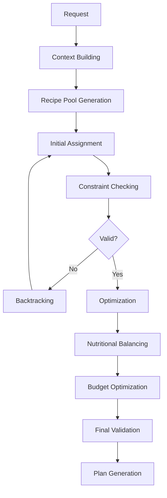

# 📋 PRP-032.1 - Core Planning Engine

## 🎯 Objectif

Développer le moteur central de planification des repas qui orchestrera l'ensemble de la logique métier pour la génération, l'optimisation et la gestion des plans de repas hebdomadaires.

## 🏗️ Architecture du Core Engine

### 1. Structure modulaire

```typescript
// Core Planning Engine Architecture
/services/planning/
  ├── core/
  │   ├── MealPlanningEngine.ts         // Moteur principal
  │   ├── MealPlanOptimizer.ts          // Optimisation des plans
  │   ├── NutritionalBalancer.ts        // Équilibrage nutritionnel
  │   ├── BudgetOptimizer.ts            // Optimisation budgétaire
  │   └── ConstraintsSolver.ts          // Résolution des contraintes
  ├── generators/
  │   ├── WeeklyPlanGenerator.ts        // Génération hebdomadaire
  │   ├── MealSuggestionEngine.ts       // Suggestions de repas
  │   └── AlternativesGenerator.ts      // Génération d'alternatives
  ├── analyzers/
  │   ├── InventoryAnalyzer.ts          // Analyse de l'inventaire
  │   ├── SeasonalAnalyzer.ts           // Analyse saisonnière
  │   └── PreferencesAnalyzer.ts        // Analyse des préférences
  └── validators/
      ├── NutritionalValidator.ts       // Validation nutritionnelle
      ├── BudgetValidator.ts            // Validation budgétaire
      └── ConstraintsValidator.ts       // Validation des contraintes
```

### 2. Interfaces principales

```typescript
export interface PlanningRequest {
  userId: string;
  weekStartDate: Date;
  preferences: UserMealPreferences;
  constraints: PlanningConstraints;
  optimizationMode: 'budget' | 'nutrition' | 'time' | 'balanced';
  existingInventory?: InventoryItem[];
  excludedRecipes?: string[];
}

export interface PlanningConstraints {
  budget: {
    weekly: number;
    daily?: number;
    strict: boolean;
  };
  time: {
    maxPrepTimePerMeal: number;
    maxTotalDailyTime: number;
    busyDays: DayOfWeek[];
  };
  nutrition: {
    minCaloriesPerDay: number;
    maxCaloriesPerDay: number;
    macroTargets?: MacroNutrients;
    micronutrientRequirements?: string[];
  };
  dietary: {
    restrictions: DietaryRestriction[];
    allergies: Allergen[];
    preferences: CuisinePreference[];
  };
  variety: {
    maxRecipeRepetitionPerWeek: number;
    minCuisineTypesPerWeek: number;
    preferNewRecipes: boolean;
  };
}

export interface PlanningResult {
  success: boolean;
  plan?: WeeklyMealPlan;
  alternatives?: AlternativePlan[];
  warnings?: PlanningWarning[];
  optimizationScore: OptimizationScore;
  estimatedSavings?: number;
}
```

## 🧠 Algorithmes de planification

### 1. Algorithme de génération principal

```typescript
class MealPlanningEngine {
  async generatePlan(request: PlanningRequest): Promise<PlanningResult> {
    // Phase 1: Analyse et préparation
    const context = await this.buildPlanningContext(request);
    
    // Phase 2: Génération initiale
    const candidatePlans = await this.generateCandidatePlans(context);
    
    // Phase 3: Optimisation
    const optimizedPlans = await this.optimizePlans(
      candidatePlans, 
      request.optimizationMode
    );
    
    // Phase 4: Validation
    const validPlans = await this.validatePlans(optimizedPlans, context);
    
    // Phase 5: Sélection finale
    const selectedPlan = this.selectBestPlan(validPlans, context);
    
    // Phase 6: Post-traitement
    return this.finalizePlan(selectedPlan, context);
  }
}
```

### 2. Algorithme d'optimisation multi-critères

```typescript
interface OptimizationCriteria {
  budget: { weight: number; target: 'minimize' };
  nutrition: { weight: number; target: 'maximize' };
  variety: { weight: number; target: 'maximize' };
  inventory: { weight: number; target: 'maximize' };
  time: { weight: number; target: 'minimize' };
}

class MealPlanOptimizer {
  optimize(plans: MealPlan[], criteria: OptimizationCriteria): MealPlan[] {
    return plans
      .map(plan => ({
        plan,
        score: this.calculateCompositeScore(plan, criteria)
      }))
      .sort((a, b) => b.score - a.score)
      .map(item => this.applyLocalOptimizations(item.plan));
  }
  
  private calculateCompositeScore(
    plan: MealPlan, 
    criteria: OptimizationCriteria
  ): number {
    const scores = {
      budget: this.calculateBudgetScore(plan),
      nutrition: this.calculateNutritionScore(plan),
      variety: this.calculateVarietyScore(plan),
      inventory: this.calculateInventoryUsageScore(plan),
      time: this.calculateTimeScore(plan)
    };
    
    return Object.entries(criteria).reduce((total, [key, config]) => {
      return total + (scores[key] * config.weight);
    }, 0);
  }
}
```

### 3. Système de contraintes

```typescript
class ConstraintsSolver {
  async solve(
    meals: RecipeCandidate[], 
    constraints: PlanningConstraints
  ): Promise<ConstraintSolution> {
    // Utilisation d'un solveur de contraintes basé sur CSP
    // (Constraint Satisfaction Problem)
    
    const solver = new CSPSolver<MealAssignment>();
    
    // Variables: créneaux de repas
    const variables = this.createMealSlotVariables();
    
    // Domaines: recettes possibles
    const domains = this.createRecipeDomains(meals);
    
    // Contraintes
    solver.addConstraint(new BudgetConstraint(constraints.budget));
    solver.addConstraint(new NutritionConstraint(constraints.nutrition));
    solver.addConstraint(new TimeConstraint(constraints.time));
    solver.addConstraint(new VarietyConstraint(constraints.variety));
    solver.addConstraint(new AllergyConstraint(constraints.dietary));
    
    // Résolution
    const solutions = await solver.solve({
      variables,
      domains,
      maxSolutions: 10,
      timeout: 5000
    });
    
    return this.rankSolutions(solutions);
  }
}
```

## 📊 Modèles de données

### 1. Structures de planification

```typescript
export interface MealSlot {
  id: string;
  dayOfWeek: DayOfWeek;
  mealType: MealType;
  date: Date;
  constraints?: SlotConstraints;
}

export interface RecipeCandidate {
  recipe: Recipe;
  score: number;
  matchReasons: string[];
  missingIngredients: Ingredient[];
  inventoryMatch: number; // 0-1
  seasonalScore: number; // 0-1
  nutritionalFit: number; // 0-1
  budgetFit: number; // 0-1
}

export interface MealAssignment {
  slot: MealSlot;
  recipe: Recipe;
  servings: number;
  preparationNotes: PreparationNote[];
  shoppingRequired: ShoppingItem[];
  nutritionalContribution: NutritionalInfo;
  cost: number;
}

export interface PreparationNote {
  type: 'defrost' | 'prep_ahead' | 'marinate' | 'soak' | 'other';
  message: string;
  daysInAdvance: number;
  priority: 'high' | 'medium' | 'low';
}
```

### 2. Système de scoring

```typescript
export interface ScoringWeights {
  userPreferenceMatch: 0.3;
  nutritionalBalance: 0.25;
  budgetOptimization: 0.2;
  inventoryUtilization: 0.15;
  seasonalRelevance: 0.05;
  varietyBonus: 0.05;
}

export class RecipeScorer {
  score(
    recipe: Recipe, 
    context: PlanningContext, 
    weights: ScoringWeights
  ): RecipeScore {
    const components = {
      preference: this.scorePreferenceMatch(recipe, context.preferences),
      nutrition: this.scoreNutritionalFit(recipe, context.nutritionTargets),
      budget: this.scoreBudgetFit(recipe, context.budgetConstraints),
      inventory: this.scoreInventoryUtilization(recipe, context.inventory),
      seasonal: this.scoreSeasonalRelevance(recipe, context.season),
      variety: this.scoreVarietyContribution(recipe, context.currentPlan)
    };
    
    const totalScore = Object.entries(components).reduce(
      (sum, [key, score]) => sum + (score * weights[key]), 
      0
    );
    
    return {
      total: totalScore,
      components,
      confidence: this.calculateConfidence(components)
    };
  }
}
```

## 🔄 Flux de traitement

### 1. Pipeline de génération



### 2. Stratégies d'optimisation

```typescript
export enum OptimizationStrategy {
  GREEDY = 'greedy',              // Rapide, résultats acceptables
  GENETIC = 'genetic',            // Lent, résultats optimaux
  SIMULATED_ANNEALING = 'sa',     // Équilibré
  HYBRID = 'hybrid'               // Adaptatif selon complexité
}

export class OptimizationStrategySelector {
  selectStrategy(
    complexity: PlanningComplexity, 
    timeConstraint: number
  ): OptimizationStrategy {
    if (complexity.score < 0.3 && timeConstraint > 1000) {
      return OptimizationStrategy.GREEDY;
    } else if (complexity.score > 0.7 && timeConstraint > 5000) {
      return OptimizationStrategy.GENETIC;
    } else if (timeConstraint > 3000) {
      return OptimizationStrategy.SIMULATED_ANNEALING;
    }
    return OptimizationStrategy.HYBRID;
  }
}
```

## 🎯 Fonctionnalités avancées

### 1. Machine Learning Integration

```typescript
export class MLPlanningEnhancer {
  private model: TensorFlowModel;
  
  async enhancePlan(
    plan: WeeklyMealPlan, 
    userHistory: UserMealHistory
  ): Promise<EnhancedPlan> {
    // Prédiction des préférences
    const preferences = await this.predictPreferences(userHistory);
    
    // Ajustement des scores
    const adjustedScores = await this.adjustRecipeScores(
      plan.meals,
      preferences
    );
    
    // Suggestions personnalisées
    const suggestions = await this.generatePersonalizedSuggestions(
      plan,
      userHistory,
      preferences
    );
    
    return {
      ...plan,
      mlEnhancements: {
        confidenceScore: 0.85,
        personalizationLevel: 'high',
        suggestions
      }
    };
  }
}
```

### 2. Adaptation temps réel

```typescript
export class RealtimeAdaptationEngine {
  async adaptPlan(
    currentPlan: WeeklyMealPlan,
    event: AdaptationEvent
  ): Promise<AdaptedPlan> {
    switch (event.type) {
      case 'INGREDIENT_UNAVAILABLE':
        return this.handleIngredientUnavailability(currentPlan, event);
        
      case 'SCHEDULE_CHANGE':
        return this.handleScheduleChange(currentPlan, event);
        
      case 'BUDGET_UPDATE':
        return this.handleBudgetUpdate(currentPlan, event);
        
      case 'PREFERENCE_CHANGE':
        return this.handlePreferenceChange(currentPlan, event);
        
      default:
        return currentPlan;
    }
  }
  
  private async handleIngredientUnavailability(
    plan: WeeklyMealPlan,
    event: AdaptationEvent
  ): Promise<AdaptedPlan> {
    const affectedMeals = this.findAffectedMeals(plan, event.data.ingredient);
    const alternatives = await this.generateAlternatives(affectedMeals);
    
    return this.applyBestAlternatives(plan, alternatives);
  }
}
```

## 📈 Métriques et monitoring

### 1. KPIs du moteur

```typescript
export interface EngineMetrics {
  performance: {
    avgGenerationTime: number;      // ms
    successRate: number;            // 0-1
    constraintSatisfactionRate: number;
    optimizationEfficiency: number;
  };
  quality: {
    nutritionalBalanceScore: number;
    budgetAccuracy: number;
    userSatisfactionScore: number;
    varietyScore: number;
  };
  usage: {
    plansGenerated: number;
    plansModified: number;
    popularRecipes: Recipe[];
    commonConstraints: string[];
  };
}
```

### 2. Système de feedback

```typescript
export class PlanningFeedbackLoop {
  async collectFeedback(
    planId: string, 
    feedback: UserFeedback
  ): Promise<void> {
    // Collecte du feedback
    await this.storeFeedback(planId, feedback);
    
    // Analyse immédiate
    const insights = await this.analyzeFeedback(feedback);
    
    // Ajustement des poids
    if (insights.requiresAdjustment) {
      await this.adjustScoringWeights(insights);
    }
    
    // Mise à jour du modèle ML
    await this.updateMLModel(planId, feedback);
  }
}
```

## 🔧 Configuration et tuning

### 1. Paramètres configurables

```yaml
planning_engine:
  optimization:
    max_iterations: 1000
    convergence_threshold: 0.95
    timeout_ms: 5000
    
  constraints:
    budget_flexibility: 0.1  # 10% de marge
    nutrition_flexibility: 0.15
    time_flexibility: 0.2
    
  scoring:
    preference_weight: 0.3
    nutrition_weight: 0.25
    budget_weight: 0.2
    inventory_weight: 0.15
    seasonal_weight: 0.05
    variety_weight: 0.05
    
  ml_features:
    enabled: true
    model_update_frequency: weekly
    confidence_threshold: 0.7
```

### 2. Mode debug

```typescript
export interface PlanningDebugInfo {
  request: PlanningRequest;
  context: PlanningContext;
  candidateRecipes: RecipeCandidate[];
  constraintViolations: ConstraintViolation[];
  optimizationSteps: OptimizationStep[];
  finalScore: number;
  alternativePlans: AlternativePlan[];
  performanceMetrics: PerformanceMetrics;
}

export class PlanningDebugger {
  async debugPlanGeneration(
    request: PlanningRequest
  ): Promise<PlanningDebugInfo> {
    // Mode debug avec logging détaillé
    const debugContext = this.enableDebugMode();
    
    try {
      const result = await this.engine.generatePlan(request);
      return this.extractDebugInfo(debugContext, result);
    } finally {
      this.disableDebugMode();
    }
  }
}
```

## 🚀 Roadmap technique

### Phase 1 - Core (Sprint 1)
- [ ] Implémenter MealPlanningEngine de base
- [ ] Créer le système de contraintes simple
- [ ] Intégrer avec la base de recettes
- [ ] Tests unitaires complets

### Phase 2 - Optimisation (Sprint 2)
- [ ] Ajouter les algorithmes d'optimisation
- [ ] Implémenter le scoring multicritères
- [ ] Créer le système de feedback
- [ ] Tests de performance

### Phase 3 - Intelligence (Sprint 3)
- [ ] Intégrer le ML pour personnalisation
- [ ] Ajouter l'adaptation temps réel
- [ ] Implémenter les métriques avancées
- [ ] A/B testing framework

## 🔐 Considérations de sécurité

- Validation stricte des entrées utilisateur
- Rate limiting sur les générations de plans
- Isolation des données utilisateur
- Audit trail des modifications
- Chiffrement des préférences sensibles