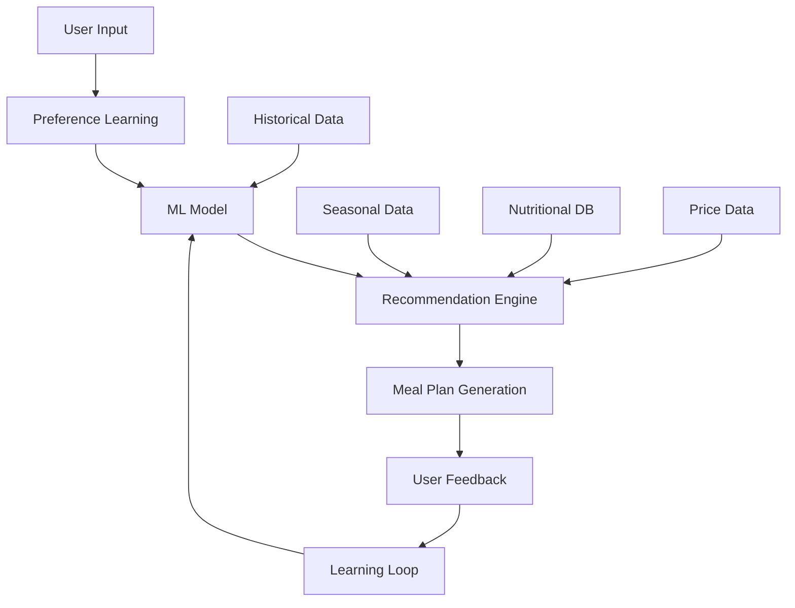

# 📋 PRP-032.2 - Intelligence Layer

## 🎯 Objectif

Développer la couche d'intelligence artificielle pour le système de planification de repas, incluant l'apprentissage des préférences, les recommandations personnalisées et l'optimisation continue.

## 🧠 Architecture de l'Intelligence Layer

### 1. Vue d'ensemble



### 2. Composants principaux

```typescript
/services/planning/intelligence/
├── ml/
│   ├── PreferenceLearner.ts          // Apprentissage des préférences
│   ├── PatternRecognizer.ts          // Reconnaissance de patterns
│   ├── TasteProfiler.ts              // Profil gustatif utilisateur
│   └── PredictiveModel.ts            // Modèle prédictif
├── recommendation/
│   ├── SmartRecommender.ts           // Moteur de recommandations
│   ├── SeasonalAdvisor.ts            // Conseils saisonniers
│   ├── BudgetAdvisor.ts              // Optimisation budget
│   └── NutritionAdvisor.ts           // Conseils nutritionnels
├── adaptation/
│   ├── RealTimeAdapter.ts            // Adaptation temps réel
│   ├── ContextAnalyzer.ts            // Analyse du contexte
│   └── DynamicOptimizer.ts           // Optimisation dynamique
└── learning/
    ├── FeedbackProcessor.ts          // Traitement du feedback
    ├── LearningLoop.ts               // Boucle d'apprentissage
    └── PerformanceTracker.ts         // Suivi des performances
```

## 🤖 Système d'apprentissage des préférences

### 1. Collecte de données

```typescript
interface UserBehaviorData {
  // Actions explicites
  recipesLiked: string[];
  recipesDisliked: string[];
  recipesCooked: string[];
  recipesSkipped: string[];
  
  // Actions implicites
  viewDuration: Record<string, number>;
  searchQueries: string[];
  filterUsage: FilterPattern[];
  
  // Contexte
  cookingTimes: TimePattern[];
  shoppingPatterns: ShoppingBehavior[];
  seasonalPreferences: SeasonalPattern[];
}

interface TimePattern {
  dayOfWeek: number;
  mealType: MealType;
  averagePrepTime: number;
  complexity: 'simple' | 'medium' | 'complex';
}

interface FilterPattern {
  filters: string[];
  frequency: number;
  context: string;
}
```

### 2. Modèle d'apprentissage

```typescript
class PreferenceLearner {
  private model: TensorFlowModel;
  private userProfile: UserTasteProfile;
  
  async learnFromBehavior(data: UserBehaviorData): Promise<LearnedPreferences> {
    // 1. Feature extraction
    const features = this.extractFeatures(data);
    
    // 2. Pattern recognition
    const patterns = this.recognizePatterns(features);
    
    // 3. Preference scoring
    const preferences = this.scorePreferences(patterns);
    
    // 4. Profile update
    this.updateUserProfile(preferences);
    
    return {
      cuisineAffinities: this.calculateCuisineAffinities(),
      ingredientPreferences: this.calculateIngredientPreferences(),
      cookingHabits: this.analyzeCookingHabits(),
      nutritionalTendencies: this.analyzeNutritionalTendencies()
    };
  }
  
  private extractFeatures(data: UserBehaviorData): FeatureVector {
    return {
      // Goûts
      sweetPreference: this.calculateSweetScore(data),
      spicyTolerance: this.calculateSpiceScore(data),
      vegetableAffinity: this.calculateVegetableScore(data),
      
      // Habitudes
      cookingFrequency: this.analyzeFrequency(data),
      mealComplexity: this.analyzeComplexity(data),
      timeConstraints: this.analyzeTimePatterns(data),
      
      // Nutrition
      healthConsciousness: this.analyzeHealthChoices(data),
      calorieAwareness: this.analyzeCaloriePatterns(data),
      macroBalance: this.analyzeMacroChoices(data)
    };
  }
}
```

## 🎯 Moteur de recommandations intelligent

### 1. Architecture du recommender

```typescript
class SmartRecommender {
  private preferenceModel: PreferenceLearner;
  private contextAnalyzer: ContextAnalyzer;
  private nutritionEngine: NutritionAdvisor;
  private seasonalAdvisor: SeasonalAdvisor;
  
  async generateRecommendations(
    context: PlanningContext,
    preferences: LearnedPreferences
  ): Promise<MealRecommendations> {
    // 1. Analyse du contexte actuel
    const contextFactors = await this.analyzeContext(context);
    
    // 2. Filtrage collaboratif
    const collaborativeMatches = await this.findCollaborativeMatches(
      preferences,
      context.userId
    );
    
    // 3. Recommandations basées sur le contenu
    const contentBasedMatches = await this.findContentMatches(
      preferences,
      context.availableRecipes
    );
    
    // 4. Hybridation et scoring
    const hybridRecommendations = this.hybridizeRecommendations(
      collaborativeMatches,
      contentBasedMatches,
      contextFactors
    );
    
    // 5. Personnalisation finale
    return this.personalizeRecommendations(
      hybridRecommendations,
      preferences,
      context
    );
  }
  
  private async analyzeContext(context: PlanningContext): Promise<ContextFactors> {
    return {
      season: this.seasonalAdvisor.getCurrentSeason(),
      weather: await this.getWeatherContext(),
      timeOfDay: new Date().getHours(),
      dayOfWeek: new Date().getDay(),
      inventory: context.inventoryAnalysis,
      recentMeals: await this.getRecentMeals(context.userId),
      upcomingEvents: await this.getUpcomingEvents(context.userId)
    };
  }
}
```

### 2. Algorithmes de recommandation

```typescript
interface RecommendationAlgorithm {
  // Filtrage collaboratif
  collaborativeFiltering: {
    userSimilarity: 'cosine' | 'pearson' | 'jaccard';
    minSimilarUsers: 5;
    neighborhoodSize: 20;
  };
  
  // Basé sur le contenu
  contentBased: {
    features: ['ingredients', 'cuisine', 'nutrition', 'complexity'];
    similarity: 'euclidean' | 'manhattan' | 'minkowski';
    weightingScheme: 'tf-idf' | 'bm25';
  };
  
  // Hybridation
  hybrid: {
    strategy: 'weighted' | 'switching' | 'mixed';
    collaborativeWeight: 0.4;
    contentWeight: 0.6;
    contextWeight: 0.3;
  };
}
```

## 🔄 Système d'adaptation temps réel

### 1. Adaptateur dynamique

```typescript
class RealTimeAdapter {
  async adaptPlan(
    currentPlan: WeeklyMealPlan,
    event: AdaptationEvent
  ): Promise<AdaptedMealPlan> {
    const adaptationStrategy = this.selectStrategy(event);
    
    switch (event.type) {
      case 'INGREDIENT_UNAVAILABLE':
        return this.handleIngredientUnavailability(currentPlan, event);
        
      case 'SCHEDULE_CHANGE':
        return this.handleScheduleChange(currentPlan, event);
        
      case 'BUDGET_UPDATE':
        return this.handleBudgetUpdate(currentPlan, event);
        
      case 'DIETARY_RESTRICTION_ADDED':
        return this.handleNewRestriction(currentPlan, event);
        
      case 'GUEST_ADDED':
        return this.handleGuestAddition(currentPlan, event);
        
      case 'WEATHER_CHANGE':
        return this.handleWeatherChange(currentPlan, event);
        
      default:
        return currentPlan;
    }
  }
  
  private async handleIngredientUnavailability(
    plan: WeeklyMealPlan,
    event: AdaptationEvent
  ): Promise<AdaptedMealPlan> {
    const unavailableIngredient = event.data.ingredient;
    const affectedMeals = this.findAffectedMeals(plan, unavailableIngredient);
    
    // Stratégies d'adaptation
    const strategies = [
      this.substituteIngredient,
      this.replaceRecipe,
      this.modifyRecipe,
      this.reorderMeals
    ];
    
    for (const strategy of strategies) {
      const adapted = await strategy(plan, affectedMeals, event);
      if (adapted.success) {
        return adapted.plan;
      }
    }
    
    // Fallback: notification utilisateur
    return {
      ...plan,
      warnings: [{
        type: 'ingredient_unavailable',
        message: `${unavailableIngredient} non disponible, adaptation manuelle requise`,
        meals: affectedMeals
      }]
    };
  }
}
```

### 2. Optimisation contextuelle

```typescript
class ContextualOptimizer {
  optimizeForContext(
    plan: WeeklyMealPlan,
    context: CurrentContext
  ): OptimizedPlan {
    const optimizations = [];
    
    // Optimisation météo
    if (context.weather.temperature > 30) {
      optimizations.push(this.optimizeForHotWeather(plan));
    }
    
    // Optimisation temps disponible
    if (context.timeAvailable < 30) {
      optimizations.push(this.optimizeForQuickMeals(plan));
    }
    
    // Optimisation santé
    if (context.healthGoals.active) {
      optimizations.push(this.optimizeForHealth(plan, context.healthGoals));
    }
    
    // Optimisation budget temps réel
    if (context.budgetRemaining < plan.estimatedCost * 0.8) {
      optimizations.push(this.optimizeForTightBudget(plan));
    }
    
    return this.mergeOptimizations(plan, optimizations);
  }
}
```

## 📊 Système de feedback et apprentissage

### 1. Collecteur de feedback

```typescript
interface FeedbackCollector {
  // Feedback explicite
  collectExplicitFeedback(mealId: string, feedback: UserFeedback): void;
  
  // Feedback implicite
  trackMealCompletion(mealId: string, completed: boolean): void;
  trackCookingTime(mealId: string, actualTime: number): void;
  trackLeftovers(mealId: string, leftoverAmount: number): void;
  trackRepeatRequest(mealId: string): void;
  
  // Métriques agrégées
  calculateSatisfactionScore(planId: string): number;
  identifySuccessPatterns(userId: string): Pattern[];
  identifyFailurePatterns(userId: string): Pattern[];
}

class FeedbackProcessor {
  async processFeedback(
    feedback: CollectedFeedback,
    plan: WeeklyMealPlan
  ): Promise<LearningOutcome> {
    // 1. Analyse du feedback
    const analysis = this.analyzeFeedback(feedback);
    
    // 2. Identification des patterns
    const patterns = this.identifyPatterns(analysis);
    
    // 3. Mise à jour du modèle
    await this.updateModel(patterns);
    
    // 4. Ajustement des recommandations futures
    const adjustments = this.calculateAdjustments(patterns);
    
    return {
      modelUpdated: true,
      patternsLearned: patterns.length,
      recommendationAdjustments: adjustments,
      confidenceImprovement: this.calculateConfidenceGain()
    };
  }
}
```

### 2. Boucle d'apprentissage continue

```typescript
class ContinuousLearningLoop {
  private learningRate: number = 0.01;
  private batchSize: number = 100;
  
  async runLearningCycle(): Promise<LearningCycleResult> {
    // 1. Collecter les données récentes
    const recentData = await this.collectRecentData();
    
    // 2. Préparer le dataset
    const dataset = this.prepareDataset(recentData);
    
    // 3. Entraîner le modèle
    const trainingResult = await this.trainModel(dataset);
    
    // 4. Évaluer les performances
    const evaluation = await this.evaluateModel(trainingResult.model);
    
    // 5. Déployer si amélioration
    if (evaluation.improvement > 0.05) {
      await this.deployModel(trainingResult.model);
    }
    
    // 6. Mettre à jour les métriques
    await this.updateMetrics(evaluation);
    
    return {
      cycleCompleted: true,
      improvement: evaluation.improvement,
      newPatternsDiscovered: trainingResult.newPatterns,
      modelVersion: trainingResult.model.version
    };
  }
  
  private async trainModel(dataset: TrainingDataset): Promise<TrainingResult> {
    // Utilisation d'un réseau de neurones simple
    const model = tf.sequential({
      layers: [
        tf.layers.dense({ units: 128, activation: 'relu', inputShape: [dataset.featureSize] }),
        tf.layers.dropout({ rate: 0.2 }),
        tf.layers.dense({ units: 64, activation: 'relu' }),
        tf.layers.dropout({ rate: 0.1 }),
        tf.layers.dense({ units: 32, activation: 'relu' }),
        tf.layers.dense({ units: dataset.labelSize, activation: 'softmax' })
      ]
    });
    
    model.compile({
      optimizer: tf.train.adam(this.learningRate),
      loss: 'categoricalCrossentropy',
      metrics: ['accuracy']
    });
    
    const history = await model.fit(dataset.features, dataset.labels, {
      epochs: 50,
      batchSize: this.batchSize,
      validationSplit: 0.2,
      callbacks: {
        onEpochEnd: (epoch, logs) => {
          console.log(`Epoch ${epoch}: loss = ${logs.loss}, accuracy = ${logs.acc}`);
        }
      }
    });
    
    return {
      model,
      history,
      newPatterns: this.extractNewPatterns(model, dataset)
    };
  }
}
```

## 🎨 Personnalisation avancée

### 1. Profils gustatifs

```typescript
interface TasteProfile {
  // Préférences de base
  sweetness: number; // 0-1
  saltiness: number;
  sourness: number;
  bitterness: number;
  umami: number;
  spiciness: number;
  
  // Textures préférées
  textures: {
    crispy: number;
    creamy: number;
    chewy: number;
    soft: number;
    crunchy: number;
  };
  
  // Complexité
  flavorComplexity: 'simple' | 'moderate' | 'complex';
  adventurousness: number; // 0-1, volonté d'essayer du nouveau
  
  // Influences culturelles
  culturalAffinities: {
    cuisine: string;
    affinity: number;
  }[];
}

class TasteProfiler {
  buildProfile(userHistory: UserMealHistory): TasteProfile {
    const analyzedMeals = this.analyzeMealHistory(userHistory);
    
    return {
      sweetness: this.calculateSweetnessPreference(analyzedMeals),
      saltiness: this.calculateSaltinessPreference(analyzedMeals),
      sourness: this.calculateSournessPreference(analyzedMeals),
      bitterness: this.calculateBitternessPreference(analyzedMeals),
      umami: this.calculateUmamiPreference(analyzedMeals),
      spiciness: this.calculateSpicyPreference(analyzedMeals),
      textures: this.analyzeTexturePreferences(analyzedMeals),
      flavorComplexity: this.determineComplexityPreference(analyzedMeals),
      adventurousness: this.calculateAdventurousness(analyzedMeals),
      culturalAffinities: this.analyzeCulturalPreferences(analyzedMeals)
    };
  }
}
```

### 2. Adaptation familiale

```typescript
class FamilyPreferenceAggregator {
  aggregateFamilyPreferences(
    familyMembers: FamilyMember[]
  ): AggregatedPreferences {
    const individualProfiles = familyMembers.map(member => 
      this.tasteProfiler.buildProfile(member.history)
    );
    
    return {
      // Trouver les préférences communes
      commonPreferences: this.findCommonGround(individualProfiles),
      
      // Identifier les restrictions absolues
      absoluteRestrictions: this.mergeRestrictions(familyMembers),
      
      // Calculer les compromis acceptables
      acceptableCompromises: this.calculateCompromises(individualProfiles),
      
      // Stratégies de rotation pour satisfaire tout le monde
      rotationStrategy: this.createRotationStrategy(individualProfiles),
      
      // Adaptations par membre
      memberAdaptations: this.createMemberAdaptations(familyMembers)
    };
  }
  
  private findCommonGround(profiles: TasteProfile[]): CommonPreferences {
    // Algorithme pour trouver l'intersection des préférences
    const commonCuisines = this.findCommonCuisines(profiles);
    const commonIngredients = this.findCommonIngredients(profiles);
    const acceptableSpiceLevel = Math.min(...profiles.map(p => p.spiciness));
    
    return {
      cuisines: commonCuisines,
      ingredients: commonIngredients,
      maxSpiceLevel: acceptableSpiceLevel,
      sharedTextures: this.findSharedTexturePreferences(profiles)
    };
  }
}
```

## 📈 Métriques et KPIs

### 1. Métriques d'apprentissage

```typescript
interface LearningMetrics {
  // Précision du modèle
  modelAccuracy: number;
  predictionConfidence: number;
  
  // Amélioration continue
  weeklyImprovement: number;
  patternDiscoveryRate: number;
  
  // Satisfaction utilisateur
  recommendationAcceptanceRate: number;
  mealCompletionRate: number;
  repeatRequestRate: number;
  
  // Efficacité
  adaptationSuccessRate: number;
  substitutionAcceptanceRate: number;
  
  // Santé du système
  learningCycleTime: number;
  dataQuality: number;
}
```

### 2. Dashboard intelligence

```typescript
class IntelligenceDashboard {
  getMetrics(): IntelligenceMetrics {
    return {
      // Performances ML
      ml: {
        accuracy: this.model.getAccuracy(),
        f1Score: this.model.getF1Score(),
        trainingLoss: this.model.getLatestLoss(),
        validationLoss: this.model.getValidationLoss()
      },
      
      // Recommandations
      recommendations: {
        clickThroughRate: this.getRecommendationCTR(),
        conversionRate: this.getRecommendationConversion(),
        diversityScore: this.getRecommendationDiversity(),
        noveltyScore: this.getRecommendationNovelty()
      },
      
      // Apprentissage
      learning: {
        newPatternsThisWeek: this.getWeeklyPatterns(),
        profileCompleteness: this.getProfileCompleteness(),
        dataPointsCollected: this.getDataPointCount(),
        feedbackProcessed: this.getFeedbackCount()
      },
      
      // Impact business
      business: {
        userEngagement: this.getUserEngagement(),
        planCompletionRate: this.getPlanCompletionRate(),
        wasteReduction: this.getWasteReduction(),
        budgetOptimization: this.getBudgetSavings()
      }
    };
  }
}
```

## 🚀 Roadmap Intelligence

### Phase 1 - Fondations (Sprint 1)
- [ ] Implémenter PreferenceLearner basique
- [ ] Créer SmartRecommender simple
- [ ] Intégrer feedback explicite
- [ ] Tests A/B framework

### Phase 2 - ML avancé (Sprint 2)
- [ ] Déployer modèle TensorFlow
- [ ] Implémenter apprentissage continu
- [ ] Ajouter filtrage collaboratif
- [ ] Optimiser performances

### Phase 3 - Personnalisation (Sprint 3)
- [ ] Profils gustatifs complets
- [ ] Adaptation familiale
- [ ] Contexte temps réel
- [ ] Recommandations hybrides

### Phase 4 - Intelligence augmentée (Sprint 4)
- [ ] Prédictions avancées
- [ ] Adaptation automatique
- [ ] Insights nutritionnels AI
- [ ] Assistant conversationnel

## 🔐 Considérations éthiques et sécurité

- **Privacy by design** : Données anonymisées
- **Transparence** : Expliquer les recommandations
- **Contrôle utilisateur** : Opt-out possible
- **Biais algorithmiques** : Audits réguliers
- **Sécurité des données** : Chiffrement bout-en-bout